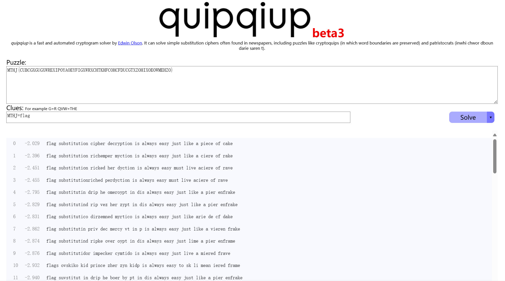

# 密码学做题笔记

## 1 工具使用

### 1.1  [Ciphey](https://github.com/Ciphey/Ciphey)

使用 `python3 -m pip install ciphey --upgrade` 安装 Ciphey

使用方法:

```shell
ciphey -f encrypted.txt
ciphey -- "Encrypted input"
ciphey -t "Encrypted input"
```

### 1.2  [FactorDB PyPI](https://pypi.org/project/factordb-python/)

使用 `python3 -m pip install factordb-pycli` 安装 FactorDB

使用方法:

```shell
factordb number
factordb --json number
```

或者作为 Python 库调用

```python
from factordb.factordb import FactorDB
```

## 2 练习记录

### [Crypto-一眼就解密](https://buuoj.cn/challenges#%E4%B8%80%E7%9C%BC%E5%B0%B1%E8%A7%A3%E5%AF%86)

易知这是一段 base64 编码，直接使用 Ciphey 解密即可

```shell
┌──(hervey㉿Hervey)-[~]
└─$ ciphey -t "ZmxhZ3tUSEVfRkxBR19PRl9USElTX1NUUklOR30="
Possible plaintext: 'flag{THE_FLAG_OF_THIS_STRING}' (y/N): y
╭───────────────────────────────────────────────────╮
│ The plaintext is a Capture The Flag (CTF) Flag    │
│ Formats used:                                     │
│    base64                                         │
│    utf8Plaintext: "flag{THE_FLAG_OF_THIS_STRING}" │
╰───────────────────────────────────────────────────
```

### [Crypto-MD5](https://buuoj.cn/challenges#MD5)

打开文件得到一段密文，根据提示猜测这是一段 MD5 校验码

使用 [cmd5](https://www.cmd5.org/) 进行解密

得到 flag 为

```plain
flag{admin1}
```

### [Crypto-Url编码](https://buuoj.cn/challenges#Url%E7%BC%96%E7%A0%81)

根据题目可以知道这是Url编码，用 Ciphey 解密即可

```shell
┌──(hervey㉿Hervey)-[~]
└─$ ciphey -- "%66%6c%61%67%7b%61%6e%64%20%31%3d%31%7d"
Possible plaintext: 'flag{and 1=1}' (y/N): y
╭────────────────────────────────────────────────╮
│ The plaintext is a Capture The Flag (CTF) Flag │
│ Formats used:                                  │
│    urlPlaintext: "flag{and 1=1}"               │
╰────────────────────────────────────────────────╯
```

### [Crypto-看我回旋踢](https://buuoj.cn/challenges#%E7%9C%8B%E6%88%91%E5%9B%9E%E6%97%8B%E8%B8%A2)

可以返现这是一段位移为 13 的凯撒加密，用 Ciphey 解密即可

```shell
┌──(hervey㉿ZHW)-[~]
└─$ ciphey -- "synt{5pq1004q-86n5-46q8-o720-oro5on0417r1}"
Possible plaintext: 'flag{5cd1004d-86a5-46d8-b720-beb5ba0417e1}' (y/N): y
╭────────────────────────────────────────────────────────────────────╮
│ The plaintext is a Capture The Flag (CTF) Flag                     │
│ Formats used:                                                      │
│    caesar:                                                         │
│     Key: 13Plaintext: "flag{5cd1004d-86a5-46d8-b720-beb5ba0417e1}" │
╰────────────────────────────────────────────────────────────────────╯
```

### [Crypto-摩丝](https://buuoj.cn/challenges#%E6%91%A9%E4%B8%9D)

打开文件后得到

```plain
.. .-.. --- ...- . -.-- --- ..-
```

是一段摩斯密码，解密后得到

```plain
ILOVEYOU
```

得到 flag 为

```plain
flag{ILOVEYOU}
```

### [Crypto-password](https://buuoj.cn/challenges#password)

打开文件后得到

```plain
姓名：张三 
生日：19900315

key格式为key{xxxxxxxxxx}
```

密码有十位，猜测是 "姓名首字母+生日" 组合

```plain
key{zs19900315}
```

得到 flag 为

```plain
flag{zs19900315}
```

### [Crypto-变异凯撒](https://buuoj.cn/challenges#%E5%8F%98%E5%BC%82%E5%87%AF%E6%92%92)

打开文件后得到

> 加密密文：afZ_r9VYfScOeO_UL^RWUc \
> 格式：flag{ }

根据题目提示可以得知应该是凯撒加密变种，将已知字符一一对应

|$\Delta$|5|6|7|8|9|?|?|?|?|?|?|?|?|?|?|?|?|?|?|?|?|26|
|:-:|:-:|:-:|:-:|:-:|:-:|:-:|:-:|:-:|:-:|:-:|:-:|:-:|:-:|:-:|:-:|:-:|:-:|:-:|:-:|:-:|:-:|:-:|
|密文|a|f|Z|_|r|9|V|Y|f|S|c|O|e|O|_|U|L|^|R|W|U|c|
|明文|f|l|a|g|{| | | | | | | | | | | | | | | | |}|

发现位移每次增加 1 ，由此，我们可以写出解密脚本

```python
secret_text = "afZ_r9VYfScOeO_UL^RWUc"
flag = ""
for i in range(len(secret_text)):
    flag += chr(ord(secret_text[i]) + 5 + i)
print(flag)
```

运行得到 flag

```shell
┌──(hervey㉿Hervey)-[/mnt/c/Users/hervey/Downloads]
└─$ python3 ./dec.py
flag{Caesar_variation}
```

### [Crypto-Quoted-printable](https://buuoj.cn/challenges#Quoted-printable)

打开文件后得到

```plain
=E9=82=A3=E4=BD=A0=E4=B9=9F=E5=BE=88=E6=A3=92=E5=93=A6
```

根据题目提示可以得知这是 `Quoted-printable` 编码

使用 CyberChef 解密可以得到

```plain
那你也很棒哦
```

进而得到 flag

```plain
flag{那你也很棒哦}
```

### [Crypto-篱笆墙的影子](https://buuoj.cn/challenges#%E7%AF%B1%E7%AC%86%E5%A2%99%E7%9A%84%E5%BD%B1%E5%AD%90)

打开文件后得到

```plain
felhaagv{ewtehtehfilnakgw}
```

猜测这应该是栅栏密码，经过一番尝试后用 [CyberChef](https://gchq.github.io/CyberChef/#recipe=Rail_Fence_Cipher_Encode(2,0)&input=ZmVsaGFhZ3Z7ZXd0ZWh0ZWhmaWxuYWtnd30) 解出了 flag

```plain
flag{wethinkwehavetheflag}
```

### [Crypto-RSA](https://buuoj.cn/challenges#RSA)

打开文件后得到

> 在一次RSA密钥对生成中，假设p=473398607161，q=4511491，e=17 \
> 求解出d作为flga提交

回顾 RSA 算法的密钥对生成过程

$$
\begin{align}
& N = p \times q & p, q 均为质数\\
& L = \varphi(N) = \varphi(p) \times \varphi(q) = lcm(p - 1, q - 1) & \varphi(n) 表示欧拉函数 \\
& gcd(E, L) = 1  &  1 < E < L \\
& E * D \equiv 1 (mod \space L) & 1 < D < L
\end{align}
$$

题目给出了 $p, q, e$ ，我们可以推出 $d$ 的计算公式为

$$
\begin{align}
& L = lcm(p - 1, q - 1) \\
& D = E^{-1} (mod \space L) \\
\end{align}
$$

其中 $E^{-1} (mod \space L)$ 代表 $E$ 在模 $L$ 意义下的乘法逆元

由此，我们可以写出 python 脚本求解 $D$

```python
import gmpy2
p = 473398607161
q = 4511491
e = 17
d = int(gmpy2.invert(e,(p-1)*(q-1)))
print(d)
```

运行得到 d

```shell
┌──(hervey㉿Hervey)-[/mnt/c/Users/hervey/Downloads]
└─$ python3 ./dec.py
125631357777427553
```

进而获得 flag

```plain
flag{125631357777427553}
```

### [Crypto-丢失的MD5](https://buuoj.cn/challenges#%E4%B8%A2%E5%A4%B1%E7%9A%84MD5)

解压后得到一个 Python 程序

```python
import hashlib   
for i in range(32,127):
    for j in range(32,127):
        for k in range(32,127):
            m=hashlib.md5()
            m.update('TASC'+chr(i)+'O3RJMV'+chr(j)+'WDJKX'+chr(k)+'ZM')
            des=m.hexdigest()
            if 'e9032' in des and 'da' in des and '911513' in des:
                print des
```

根据语法特征可以发现这是 Python2 脚本,使用 `python2` 命令运行

```shell
┌──(hervey㉿Hervey)-[~/Downloads]
└─$ python2 ./md5.py
e9032994dabac08080091151380478a2
```

可以得到 flag 为

```plain
flag{e9032994dabac08080091151380478a2}
```

### [Crypto-Alice与Bob](https://buuoj.cn/challenges#Alice%E4%B8%8EBob)

按照题目要求一步步来

首先使用 FactorDB 进行质因数分解

```shell
┌──(hervey㉿Hervey)-[~]
└─$ factordb 98554799767
101999 966233
```

然后将这两个数字拼接起来放进 [CyberChef](https://gchq.github.io/CyberChef/#recipe=MD5()&input=MTAxOTk5OTY2MjMz) 里进行 MD5 加密

得到

```plain
d450209323a847c8d01c6be47c81811a
```

进而获得 flag

```plain
flag{d450209323a847c8d01c6be47c81811a}
```

### [Crypto-大帝的密码武器](https://buuoj.cn/challenges#%E5%A4%A7%E5%B8%9D%E7%9A%84%E5%AF%86%E7%A0%81%E6%AD%A6%E5%99%A8)

下载后得到一个名为 `zip` 的文件，`binwalk` 后发现这是一个压缩文件，将其解压

```shell
┌──(hervey㉿Hervey)-[/mnt/c/Users/hervey/Downloads]
└─$ binwalk zip

DECIMAL       HEXADECIMAL     DESCRIPTION
--------------------------------------------------------------------------------
307           0x133           Zip archive data, at least v1.0 to extract, name: __MACOSX/
1440          0x5A0           End of Zip archive, footer length: 22


┌──(hervey㉿Hervey)-[/mnt/c/Users/hervey/Downloads]
└─$ unzip zip
Archive:  zip
  inflating: 题目.txt
   creating: __MACOSX/
  inflating: __MACOSX/._题目.txt
  inflating: 密文.txt
  inflating: __MACOSX/._密文.txt
```

在 `题目.txt` 中可以看到题目

> 公元前一百年，在罗马出生了一位对世界影响巨大的人物，他生前是罗马三巨头之一。他率先使用了一种简单的加密函，因此这种加密方法以他的名字命名。\
> 以下密文被解开后可以获得一个有意义的单词：FRPHEVGL \
> 你可以用这个相同的加密向量加密附件中的密文，作为答案进行提交。

使用 Ciphey 试着解密一下这段密文

```shell
┌──(hervey㉿ZHW)-[/mnt/c/Users/zhwaa/Downloads]
└─$ ciphey -- "FRPHEVGL"
Possible plaintext: 'B~@lEU' (y/N):
Possible plaintext: '/B?@XS' (y/N):
Possible plaintext: 'SECURITY' (y/N): y
╭─────────────────────────────────────────╮
│ Formats used:                           │
│    affine:                              │
│     Key: a=1, b=13Plaintext: "SECURITY" │
╰─────────────────────────────────────────╯
```

使用同样的方式加密 `密文.txt` 的文字

```plain
ComeChina
```

这里使用 [CyberChef](https://gchq.github.io/CyberChef/#recipe=ROT13(true,true,true,13)&input=Q29tZUNoaW5h) 选择 ROT13，可以得到

```plain
PbzrPuvan
```

进而获得 flag

```plain
flag{PbzrPuvan}
```

### [Crypto-rsarsa](https://buuoj.cn/challenges#%rsarsa)

打开文件后得到

> Math is cool! Use the RSA algorithm to decode the secret message, c, p, q, and e are parameters for the RSA algorithm.
> p =  9648423029010515676590551740010426534945737639235739800643989352039852507298491399561035009163427050370107570733633350911691280297777160200625281665378483
> q =  11874843837980297032092405848653656852760910154543380907650040190704283358909208578251063047732443992230647903887510065547947313543299303261986053486569407
> e =  65537
> c =  83208298995174604174773590298203639360540024871256126892889661345742403314929861939100492666605647316646576486526217457006376842280869728581726746401583705899941768214138742259689334840735633553053887641847651173776251820293087212885670180367406807406765923638973161375817392737747832762751690104423869019034
> Use RSA to find the secret message

回顾 RSA 算法的公式

$$
\begin{align}
& C = M ^ E (mod \space N) & (加密)\\
& M = C ^ D (mod \space N) & (解密)\\
& N = p \times q & p, q 均为质数\\
& L = \varphi(N) = \varphi(p) \times \varphi(q) = lcm(p - 1, q - 1) & \varphi(n) 表示欧拉函数 \\
& gcd(E, L) = 1  &  1 < E < L \\
& E * D \equiv 1 (mod \space L) & 1 < D < L
\end{align}
$$

题目给出了 $p, q, e, c$ ，我们可以推出 $m$ 的计算公式为

$$
\begin{align}
& L = lcm(p - 1, q - 1) \\
& D = E^{-1} (mod \space L) \\
& N = p \times q \\
& M = C ^ D (mod \space N) \\
\end{align}
$$

其中 $E^{-1} (mod \space L)$ 代表 $E$ 在模 $L$ 意义下的乘法逆元

由此，我们可以写出 python 脚本求解 $M$

```python
import gmpy2
p = 9648423029010515676590551740010426534945737639235739800643989352039852507298491399561035009163427050370107570733633350911691280297777160200625281665378483
q = 11874843837980297032092405848653656852760910154543380907650040190704283358909208578251063047732443992230647903887510065547947313543299303261986053486569407
c = 83208298995174604174773590298203639360540024871256126892889661345742403314929861939100492666605647316646576486526217457006376842280869728581726746401583705899941768214138742259689334840735633553053887641847651173776251820293087212885670180367406807406765923638973161375817392737747832762751690104423869019034
e = 65537
n = p * q
d = int(gmpy2.invert(e,(p-1)*(q-1)))
m = pow(c, d, n)
print(m)
```

运行得到 m

```shell
┌──(hervey㉿Hervey)-[/mnt/c/Users/hervey/Downloads]
└─$ python3 ./dec.py
5577446633554466577768879988
```

进而获得 flag

```plain
flag{5577446633554466577768879988}
```

### [Crypto-Windows系统密码](https://buuoj.cn/challenges#Windows%E7%B3%BB%E7%BB%9F%E5%AF%86%E7%A0%81)

解压后得到一个 `pass.hash` 文件

```hash
Administrator:500:aad3b435b51404eeaad3b435b51404ee:31d6cfe0d16ae931b73c59d7e0c089c0:::
ctf:1002:06af9108f2e1fecf144e2e8adef09efd:a7fcb22a88038f35a8f39d503e7f0062:::
Guest:501:aad3b435b51404eeaad3b435b51404ee:31d6cfe0d16ae931b73c59d7e0c089c0:::
SUPPORT_388945a0:1001:aad3b435b51404eeaad3b435b51404ee:bef14eee40dffbc345eeb3f58e290d56:::
```

在网上能够查到 Windows 用户密码的加密方法一般为 **LAN Manager (LM)** 和 **NT LAN Manager(NTLM)** 两种

使用 [CMD5](https://cmd5.org/) 解密文件中的有效片段

发现只有`a7fcb22a88038f35a8f39d503e7f0062` 解密后有意义，为 `good-luck`

进而获得 flag

```plain
flag{good-luck}
```

### [Crypto-信息化时代的步伐](https://buuoj.cn/challenges#%E4%BF%A1%E6%81%AF%E5%8C%96%E6%97%B6%E4%BB%A3%E7%9A%84%E6%AD%A5%E4%BC%90)

打开文件获得一串数字

```plain
606046152623600817831216121621196386
```

这是一段中文电码，用 [这个网站](https://www.qqxiuzi.cn/bianma/dianbao.php) 翻译(选择中文电报)得到原文为

```plain
计算机要从娃娃抓起
```

进而获得 flag

```plain
flag{计算机要从娃娃抓起}
```

### [Crypto-凯撒？替换？呵呵!](https://buuoj.cn/challenges#%E5%87%AF%E6%92%92%EF%BC%9F%E6%9B%BF%E6%8D%A2%EF%BC%9F%E5%91%B5%E5%91%B5!)

题目是一串无意义的字符串

```plain
MTHJ{CUBCGXGUGXWREXIPOYAOEYFIGXWRXCHTKHFCOHCFDUCGTXZOHIXOEOWMEHZO}
```

可以知道 flag 的格式是 `flag{}`

可以使用 [quipqiup](https://quipqiup.com/) 进行爆破



得到明文为

```plain
flag substitution cipher decryption is always easy just like a piece of cake
```

进而获得 flag

```plain
flag{substitutioncipherdecryptionisalwayseasyjustlikeapieceofcake}
```

### [Crypto-萌萌哒的八戒](https://buuoj.cn/challenges#%E8%90%8C%E8%90%8C%E5%93%92%E7%9A%84%E5%85%AB%E6%88%92)

下载文件后发现无法解压，用 `binwalk` 命令查看类型

```shell
┌──(hervey㉿Hervey)-[/mnt/c/Users/hervey/Downloads]
└─$ binwalk ./76ad2edd-8ea9-4d01-805b-1dd6d525dee8.zip

DECIMAL       HEXADECIMAL     DESCRIPTION
--------------------------------------------------------------------------------
0             0x0             RAR archive data, version 4.x, first volume type: MAIN_HEAD
```

发现是一个 RAR 文件,使用对应工具解压后得到一张图片


可以发现在图片最底下有一段猪圈密码，可以使用 [这个网站](https://www.metools.info/code/c90.html) 进行解密，得到明文

```plain
whenthepigwanttoeat
```

进而获得 flag

```plain
flag{whenthepigwanttoeat}
```
