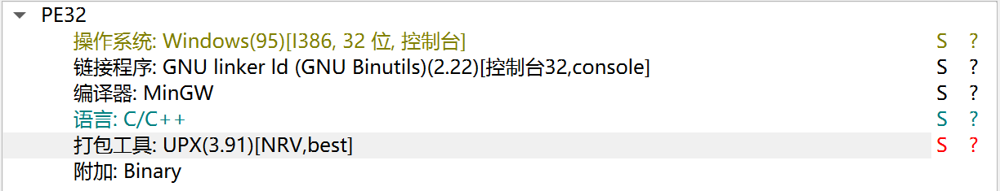
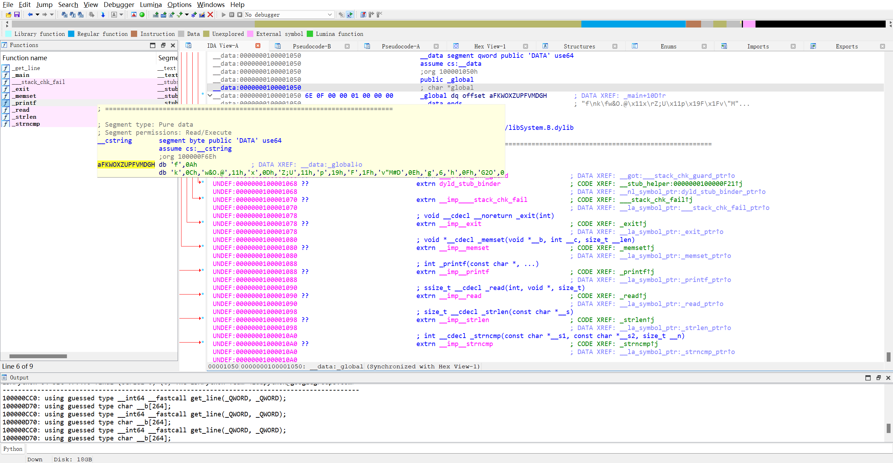

# 逆向做题笔记

## 练习记录

### [Reverse-easyre](https://buuoj.cn/challenges#easyre)

先用 DIE 查壳，发现是个无壳的 64 位程序

使用 IDA64 打开 `easyre.exe` 文件，找到程序的入口 `main` :

```c
int __cdecl main(int argc, const char **argv, const char **envp)
{
  int b; // [rsp+28h] [rbp-8h] BYREF
  int a; // [rsp+2Ch] [rbp-4h] BYREF

  _main();
  scanf("%d%d", &a, &b);
  if ( a == b )
    printf("flag{this_Is_a_EaSyRe}");
  else
    printf("sorry,you can't get flag");
  return 0;
}
```

上面这段程序的逻辑是读入两个 `int` 类型数字 `a` 和 `b` ，如果两个数字相等则输出flag，否则输出错误信息，从而获得 `flag` :

```plain
flag{this_Is_a_EaSyRe}
```

### [Reverse-reverse1](https://buuoj.cn/challenges#reverse1)

先用 DIE 查壳，发现是个无壳的 64 位程序

使用 IDA64 打开 `reverse_1.exe` 文件，找到程序的入口 `main_0` :

```c
int __cdecl main_0(int argc, const char **argv, const char **envp)
{
  char *v3; // rdi
  __int64 i; // rcx
  size_t v5; // rax
  char v7; // [rsp+0h] [rbp-20h] BYREF
  int j; // [rsp+24h] [rbp+4h]
  char Str1[224]; // [rsp+48h] [rbp+28h] BYREF
  __int64 v10; // [rsp+128h] [rbp+108h]

  v3 = &v7;
  for ( i = 82i64; i; --i )
  {
    *(_DWORD *)v3 = -858993460;
    v3 += 4;
  }
  for ( j = 0; ; ++j )
  {
    v10 = j;
    if ( j > j_strlen(Str2) )
      break;
    if ( Str2[j] == 111 )
      Str2[j] = 48;
  }
  sub_1400111D1("input the flag:");
  sub_14001128F("%20s", Str1);
  v5 = j_strlen(Str2);
  if ( !strncmp(Str1, Str2, v5) )
    sub_1400111D1("this is the right flag!\n");
  else
    sub_1400111D1("wrong flag\n");
  return 0;
}
```

通过结合运行结果和程序来看，这段程序中的 `sub_1400111D1` 对应的应该是 `printf` 函数， `sub_14001128F` 对应的应该是 `scanf` 函数，可以选中后使用 `右键 >> Rename global item` 进行替换。

接下来我们观察上面这一段 `for` 循环，这段 `for` 循环的逻辑似乎是遍历 `Str2` 的每一位，如果该位的值为 `111` 则将其替换为 `48` 由于 `Str2` 的类型是字符数组，所以 `111` 和 `48` 应该是ASCII码对应的字符 可以选中后 `右键 >> Char` 将其转化为字符，最终我们得到的程序如下:

```c
int __cdecl main_0(int argc, const char **argv, const char **envp)
{
  char *v3; // rdi
  __int64 i; // rcx
  size_t v5; // rax
  char v7; // [rsp+0h] [rbp-20h] BYREF
  int j; // [rsp+24h] [rbp+4h]
  char Str1[224]; // [rsp+48h] [rbp+28h] BYREF
  __int64 v10; // [rsp+128h] [rbp+108h]

  v3 = &v7;
  for ( i = 82i64; i; --i )
  {
    *(_DWORD *)v3 = -858993460;
    v3 += 4;
  }
  for ( j = 0; ; ++j )
  {
    v10 = j;
    if ( j > j_strlen(Str2) )
      break;
    if ( Str2[j] == 'o' )
      Str2[j] = '0';
  }
  printf("input the flag:");
  scanf("%20s", Str1);
  v5 = j_strlen(Str2);
  if ( !strncmp(Str1, Str2, v5) )
    printf("this is the right flag!\n");
  else
    printf("wrong flag\n");
  return 0;
}
```

这样，程序的逻辑就变得非常清晰了：将 `Str2` 中的每个 `o` 替换为 `0` ，读入一个字符串 `Str1` 与其进行比较，如果相同说明校验成果，否则输出错误信息，接下来我们要做的就是找到 `Str2` 以便得知我们需要输入的信息。

双击 `Str2` 跳转到静态数据区，可以观察到这样一段代码

```asm
.data:000000014001C000                               ; char Str2[]
.data:000000014001C000 7B 68 65 6C 6C 6F 5F 77 6F 72+Str2 db '{hello_world}',0               ; DATA XREF: main_0+4B↑o
```

说明 `Str2` 的初始值为 `{hello_world}` 经过 `for` 循环处理后获得 `{hell0_w0rld}` ，由此获得 `flag` .

```plain
flag{hell0_w0rld}
```

### [Reverse-reverse2](https://buuoj.cn/challenges#reverse2)

先用 DIE 查壳，这次是个 ELF64 文件

使用 IDA64 打开 `reverse_2` 文件，找到程序的入口 `main` :

```c
int __cdecl main(int argc, const char **argv, const char **envp)
{
  int stat_loc; // [rsp+4h] [rbp-3Ch] BYREF
  int i; // [rsp+8h] [rbp-38h]
  __pid_t pid; // [rsp+Ch] [rbp-34h]
  char s2[24]; // [rsp+10h] [rbp-30h] BYREF
  unsigned __int64 v8; // [rsp+28h] [rbp-18h]

  v8 = __readfsqword(0x28u);
  pid = fork();
  if ( pid )
  {
    waitpid(pid, &stat_loc, 0);
  }
  else
  {
    for ( i = 0; i <= strlen(&flag); ++i )
    {
      if ( *(&flag + i) == 'i' || *(&flag + i) == 'r' )
        *(&flag + i) = '1';
    }
  }
  printf("input the flag:");
  __isoc99_scanf("%20s", s2);
  if ( !strcmp(&flag, s2) )
    return puts("this is the right flag!");
  else
    return puts("wrong flag!");
}
```

可以发现与上一题大同小异，这段程序的逻辑是将flag中的 `i` 和 `r` 替换为 `1` ，接下来单击 `flag` 查找其具体值

```asm
.data:0000000000601080 7B                            flag db '{'                             ; DATA XREF: main+34↑r
.data:0000000000601080                                                                       ; main+44↑r
.data:0000000000601080                                                                       ; main+54↑w
.data:0000000000601080                                                                       ; main+65↑o
.data:0000000000601080                                                                       ; main+BD↑o
.data:0000000000601081 68 61 63 6B 69 6E 67 5F 66 6F+aHackingForFun db 'hacking_for_fun}',0
```

可以得知 `flag` 的值为 `{hacking_for_fun}` (注意别漏了最开始的 `{` )，依照 `main` 函数的方法对 `flag` 进行处理，得到 `flag` :

```plain
flag{hack1ng_fo1_fun}
```

### [Reverse-reverse3](https://buuoj.cn/challenges#reverse3)

先用 DIE 查壳，这次是个 PE32 文件

使用 IDA 打开 `reverse_3.exe` 文件，找到程序的入口 `main` :

```c
int __cdecl main_0(int argc, const char **argv, const char **envp)
{
  int v3; // eax
  const char *v4; // eax
  size_t v5; // eax
  char v7; // [esp+0h] [ebp-188h]
  char v8; // [esp+0h] [ebp-188h]
  signed int j; // [esp+DCh] [ebp-ACh]
  int i; // [esp+E8h] [ebp-A0h]
  signed int v11; // [esp+E8h] [ebp-A0h]
  char Destination[108]; // [esp+F4h] [ebp-94h] BYREF
  char Str[28]; // [esp+160h] [ebp-28h] BYREF
  char v14[8]; // [esp+17Ch] [ebp-Ch] BYREF

  for ( i = 0; i < 100; ++i )
  {
    if ( (unsigned int)i >= 0x64 )
      j____report_rangecheckfailure();
    Destination[i] = 0;
  }
  printf("please enter the flag:", v7);
  scanf("%20s", (char)Str);
  v3 = j_strlen(Str);
  v4 = (const char *)sub_4110BE((int)Str, v3, (int)v14);
  strncpy(Destination, v4, 0x28u);
  v11 = j_strlen(Destination);
  for ( j = 0; j < v11; ++j )
    Destination[j] += j;
  v5 = j_strlen(Destination);
  if ( !strncmp(Destination, Str2, v5) )
    printf("rigth flag!\n", v8);
  else
    printf("wrong flag!\n", v8);
  return 0;
}
```

程序的大体逻辑如下:

1. 提示用户输入一个 `Str` 字符串。

2. 调用 `sub_4110BE` 函数，处理 `Str` 数组并赋值给 `v4`。

3. 将 `v4` 数组的内容复制到 `Destination` 数组中。

4. 遍历 `Destination` 中的每个字符，将其值加上其索引值 `j`。

5. 比较处理后的 `Destination` 字符串和 `Str2` 字符串，如果 `Destination` 与 `Str2` 相同，则打印 `right flag!`, 如果不同，则打印 `wrong flag!` 。

接下来的问题就是 `sub_4110BE` 函数到底是干什么的，双击进入该函数，可以发现如下代码:

```c
void *__cdecl sub_411AB0(char *a1, unsigned int a2, int *a3)
{
  int v4; // [esp+D4h] [ebp-38h]
  int v5; // [esp+D4h] [ebp-38h]
  int v6; // [esp+D4h] [ebp-38h]
  int v7; // [esp+D4h] [ebp-38h]
  int i; // [esp+E0h] [ebp-2Ch]
  unsigned int v9; // [esp+ECh] [ebp-20h]
  int v10; // [esp+ECh] [ebp-20h]
  int v11; // [esp+ECh] [ebp-20h]
  void *v12; // [esp+F8h] [ebp-14h]
  char *v13; // [esp+104h] [ebp-8h]

  if ( !a1 || !a2 )
    return 0;
  v9 = a2 / 3;
  if ( (int)(a2 / 3) % 3 )
    ++v9;
  v10 = 4 * v9;
  *a3 = v10;
  v12 = malloc(v10 + 1);
  if ( !v12 )
    return 0;
  j_memset(v12, 0, v10 + 1);
  v13 = a1;
  v11 = a2;
  v4 = 0;
  while ( v11 > 0 )
  {
    byte_41A144[2] = 0;
    byte_41A144[1] = 0;
    byte_41A144[0] = 0;
    for ( i = 0; i < 3 && v11 >= 1; ++i )
    {
      byte_41A144[i] = *v13;
      --v11;
      ++v13;
    }
    if ( !i )
      break;
    switch ( i )
    {
      case 1:
        *((_BYTE *)v12 + v4) = aAbcdefghijklmn[(int)(unsigned __int8)byte_41A144[0] >> 2];
        v5 = v4 + 1;
        *((_BYTE *)v12 + v5) = aAbcdefghijklmn[((byte_41A144[1] & 0xF0) >> 4) | (16 * (byte_41A144[0] & 3))];
        *((_BYTE *)v12 + ++v5) = aAbcdefghijklmn[64];
        *((_BYTE *)v12 + ++v5) = aAbcdefghijklmn[64];
        v4 = v5 + 1;
        break;
      case 2:
        *((_BYTE *)v12 + v4) = aAbcdefghijklmn[(int)(unsigned __int8)byte_41A144[0] >> 2];
        v6 = v4 + 1;
        *((_BYTE *)v12 + v6) = aAbcdefghijklmn[((byte_41A144[1] & 0xF0) >> 4) | (16 * (byte_41A144[0] & 3))];
        *((_BYTE *)v12 + ++v6) = aAbcdefghijklmn[((byte_41A144[2] & 0xC0) >> 6) | (4 * (byte_41A144[1] & 0xF))];
        *((_BYTE *)v12 + ++v6) = aAbcdefghijklmn[64];
        v4 = v6 + 1;
        break;
      case 3:
        *((_BYTE *)v12 + v4) = aAbcdefghijklmn[(int)(unsigned __int8)byte_41A144[0] >> 2];
        v7 = v4 + 1;
        *((_BYTE *)v12 + v7) = aAbcdefghijklmn[((byte_41A144[1] & 0xF0) >> 4) | (16 * (byte_41A144[0] & 3))];
        *((_BYTE *)v12 + ++v7) = aAbcdefghijklmn[((byte_41A144[2] & 0xC0) >> 6) | (4 * (byte_41A144[1] & 0xF))];
        *((_BYTE *)v12 + ++v7) = aAbcdefghijklmn[byte_41A144[2] & 0x3F];
        v4 = v7 + 1;
        break;
    }
  }
  *((_BYTE *)v12 + v4) = 0;
  return v12;
}
```

通过分析 ~~(询问AI)~~ 可知这是一段 `base64` 加密程序，其中 `aAbcdefghijklmn` 数组的值为 `ABCDEFGHIJKLMNOPQRSTUVWXYZabcdefghijklmnopqrstuvwxyz0123456789+/=` 与标准的 `base64` 编码表一致。

至此，我们可以得知这段程序的逻辑是对输入的字符串先进行base64加密，接着对每位进行移位操作，与Str2字符串进行比对校验。

进入静态数据区我们可以获得字符串 `Str2` 的值为 `e3nifIH9b_C@n@dH`

```asm
.data:0041A034                               ; char Str2[]
.data:0041A034 65 33 6E 69 66 49 48 39 62 5F+Str2 db 'e3nifIH9b_C@n@dH',0            ; DATA XREF: _main_0+142↑o
```

对 `main` 函数流程逆向获得解密程序

```python
import base64

Str2 = "e3nifIH9b_C@n@dH"
temp = ""

# 逆向索引偏移操作
for i in range(len(Str2)):
    # 将每个字符的ASCII值减去其索引值
    temp += chr(ord(Str2[i]) - i)

# 对结果进行Base64解码
flag = base64.b64decode(temp).decode('utf-8')

print(f"The flag is: flag{flag}")
```

从而获得 `flag`:

```plain
flag{i_l0ve_you}
```

### [Reverse-内涵的软件](https://buuoj.cn/challenges#内涵的软件)

先用 DIE 查壳，这次是个 PE32 文件

先运行一下程序

```bash
hervey@Hervey MINGW64 ~/Desktop
$ ./70125468-0786-4705-bd91-87037f8f3e16.exe
距离出现答案还有5秒，请耐心等待！
距离出现答案还有4秒，请耐心等待！
距离出现答案还有3秒，请耐心等待！
距离出现答案还有2秒，请耐心等待！
距离出现答案还有1秒，请耐心等待！
距离出现答案还有0秒，请耐心等待！


这里本来应该是答案的,但是粗心的程序员忘记把变量写进来了,你要不逆向试试看:(Y/N)
Y
OD吾爱破解或者IDA这些逆向软件都挺好的！
hervey@Hervey MINGW64 ~/Desktop
$ ./70125468-0786-4705-bd91-87037f8f3e16.exe
距离出现答案还有5秒，请耐心等待！
距离出现答案还有4秒，请耐心等待！
距离出现答案还有3秒，请耐心等待！
距离出现答案还有2秒，请耐心等待！
距离出现答案还有1秒，请耐心等待！
距离出现答案还有0秒，请耐心等待！


这里本来应该是答案的,但是粗心的程序员忘记把变量写进来了,你要不逆向试试看:(Y/N)
N
那没办法了，猜是猜不出的．
```

猜测 `flag` 应该要到源程序中找

使用IDA打开`70125468-0786-4705-bd91-87037f8f3e16.exe`文件，找到程序的入口`main`:

```c
int __cdecl main_0(int argc, const char **argv, const char **envp)
{
  char v4[4]; // [esp+4Ch] [ebp-Ch] BYREF
  const char *v5; // [esp+50h] [ebp-8h]
  int v6; // [esp+54h] [ebp-4h]

  v6 = 5;
  v5 = "DBAPP{49d3c93df25caad81232130f3d2ebfad}";
  while ( v6 >= 0 )
  {
    printf(&byte_4250EC, v6);
    sub_40100A();
    --v6;
  }
  printf(asc_425088);
  v4[0] = 1;
  scanf("%c", v4);
  if ( v4[0] == 'Y' )
  {
    printf(aOd);
    return sub_40100A();
  }
  else
  {
    if ( v4[0] == 'N' )
      printf(&byte_425034);
    else
      printf(&byte_42501C);
    return sub_40100A();
  }
}
```

看到有一串字符串 `v5 = "DBAPP{49d3c93df25caad81232130f3d2ebfad}";` 由此获得 `flag`

```plain
flag{49d3c93df25caad81232130f3d2ebfad}
```

### [Reverse-新年快乐](https://buuoj.cn/challenges#新年快乐)

惯例先用 DIE 查壳，可以发现有一层 UPX 壳



使用 [upx 工具](https://upx.github.io/) 进行脱壳

```shell
┌──(hervey㉿Hervey)-[/mnt/c/Users/hervey/Desktop]
└─$ upx -d ./新年快乐.exe
                       Ultimate Packer for eXecutables
                          Copyright (C) 1996 - 2024
UPX 4.2.2       Markus Oberhumer, Laszlo Molnar & John Reiser    Jan 3rd 2024

        File size         Ratio      Format      Name
   --------------------   ------   -----------   -----------
     27807 <-     21151   76.06%    win32/pe     新年快乐.exe

Unpacked 1 file.
```

接下来就可以使用 IDA/Ghidra 等工具进行逆向分析了，这里用 IDA 打开

```c
int __cdecl main(int argc, const char **argv, const char **envp)
{
  char Str2[14]; // [esp+12h] [ebp-3Ah] BYREF
  char Str1[44]; // [esp+20h] [ebp-2Ch] BYREF

  __main();
  strcpy(Str2, "HappyNewYear!");
  memset(Str1, 0, 32);
  printf("please input the true flag:");
  scanf("%s", Str1);
  if ( !strncmp(Str1, Str2, strlen(Str2)) )
    return puts("this is true flag!");
  else
    return puts("wrong!");
}
```

分析这段程序可以知道 Str2 就是 flag ，其值为 `HappyNewYear!`，由此得到 flag

```plain
flag{HappyNewYear!}
```

### [Reverse-xor](https://buuoj.cn/challenges#xor)

先用 DIE 查壳，可以发现是 MacOS x86-64 程序

使用 IDA64 进行静态分析

```c
int __cdecl main(int argc, const char **argv, const char **envp)
{
  int i; // [rsp+2Ch] [rbp-124h]
  char __b[264]; // [rsp+40h] [rbp-110h] BYREF

  memset(__b, 0, 0x100uLL);
  printf("Input your flag:\n");
  get_line(__b, 256LL);
  if ( strlen(__b) != 33 )
    goto LABEL_7;
  for ( i = 1; i < 33; ++i )
    __b[i] ^= __b[i - 1];
  if ( !strncmp(__b, global, 041uLL) )
    printf("Success");
  else
LABEL_7:
    printf("Failed");
  return 0;
}
```

这段程序的逻辑是输入 `flag` ，长度要求 33 位，对该字符串进行前缀异或和的操作后与 `global` 变量进行对比，一致输出 `Success` ，不一致则输出 `Failed` 。

点击 `global` 跳转到静态变量区，可以得到 `global` 变量的值为

```plain
'f',0Ah,'k',0Ch,'w&O.@',11h,'x',0Dh,'Z;U',11h,'p',19h,'F',1Fh,'v"M#D',0Eh,'g',6,'h',0Fh,'G2O',0
```



根据异或运算的性质，我们对前缀异或和的操作进行逆向，即再进行一次邻项差分以解密 flag，使用如下 python 代码实现这一过程。

```python
text = ['f', 0x0A, 'k', 0x0C, 'w', '&', 'O', '.', '@', 0x11, 'x', 0xD, 'Z', ';', 'U', 0x11, 'p', 0x19, 'F', 0x1F, 'v', '"', 'M', '#', 'D', 0x0E, 'g', 6, 'h', 0x0F, 'G', '2', 'O' ]
flag = "f"

for i in range(len(text)):
    if isinstance   (text[i], str):
        text[i] = ord(text[i])

for i in range(len(text) - 1):
    flag = flag + chr((text[i] ^ text[i + 1]))

print(flag)
```

运行以上脚本即可获得 flag

```plain
┌──(hervey㉿Hervey)-[/mnt/c/Users/hervey/Desktop]
└─$ python3 ./xor.py
flag{QianQiuWanDai_YiTongJiangHu}
```

### [Reverse-helloword](https://buuoj.cn/challenges#helloword)

下载下来后发现是个 apk 文件，使用 jadx-gui 工具进行反编译，找到 `com.example.helloworld` 下的 `MainActivity` ，得到逆向后的代码为

```java
package com.example.helloword;

import android.os.Bundle;
import android.support.v7.app.ActionBarActivity;
import android.view.Menu;
import android.view.MenuItem;

/* loaded from: classes.dex */
public class MainActivity extends ActionBarActivity {
    /* JADX INFO: Access modifiers changed from: protected */
    @Override // android.support.v7.app.ActionBarActivity, android.support.v4.app.FragmentActivity, android.app.Activity
    public void onCreate(Bundle savedInstanceState) {
        super.onCreate(savedInstanceState);
        setContentView(R.layout.activity_main);
        "flag{7631a988259a00816deda84afb29430a}".compareTo("xxxxxxxxxxxxxxxxxxxxxxxxxxxxxxxxxxxxx");
    }

    @Override // android.app.Activity
    public boolean onCreateOptionsMenu(Menu menu) {
        getMenuInflater().inflate(R.menu.main, menu);
        return true;
    }

    @Override // android.app.Activity
    public boolean onOptionsItemSelected(MenuItem item) {
        int id = item.getItemId();
        if (id == R.id.action_settings) {
            return true;
        }
        return super.onOptionsItemSelected(item);
    }
}
```

在 `onCreate()` 函数中将 flag 与另一个字符串进行对比，由此我们可以直接获得 flag

```plain
flag{7631a988259a00816deda84afb29430a}
```

### [Reverse-不一样的flag](https://buuoj.cn/challenges#不一样的flag)

使用 DIE 进行分析，发现是一个 PE32 文件

使用 IDA 打开，进入主程序

```c
int __cdecl __noreturn main(int argc, const char **argv, const char **envp)
{
  _BYTE v3[29]; // [esp+17h] [ebp-35h] BYREF
  int v4; // [esp+34h] [ebp-18h]
  int v5; // [esp+38h] [ebp-14h] BYREF
  int i; // [esp+3Ch] [ebp-10h]
  _BYTE v7[12]; // [esp+40h] [ebp-Ch] BYREF

  __main();
  v3[26] = 0;
  *(_WORD *)&v3[27] = 0;
  v4 = 0;
  strcpy(v3, "*11110100001010000101111#");
  while ( 1 )
  {
    puts("you can choose one action to execute");
    puts("1 up");
    puts("2 down");
    puts("3 left");
    printf("4 right\n:");
    scanf("%d", &v5);
    if ( v5 == 2 )
    {
      ++*(_DWORD *)&v3[25];
    }
    else if ( v5 > 2 )
    {
      if ( v5 == 3 )
      {
        --v4;
      }
      else
      {
        if ( v5 != 4 )
LABEL_13:
          exit(1);
        ++v4;
      }
    }
    else
    {
      if ( v5 != 1 )
        goto LABEL_13;
      --*(_DWORD *)&v3[25];
    }
    for ( i = 0; i <= 1; ++i )
    {
      if ( *(_DWORD *)&v3[4 * i + 25] >= 5u )
        exit(1);
    }
    if ( v7[5 * *(_DWORD *)&v3[25] - 41 + v4] == '1' )
      exit(1);
    if ( v7[5 * *(_DWORD *)&v3[25] - 41 + v4] == '#' )
    {
      puts("\nok, the order you enter is the flag!");
      exit(0);
    }
  }
}
```

通过 `printf()` 函数输出信息以及大体的程序框架可以看出这是一道迷宫逆向问题，迷宫的大小为 $5 \times 5$ ，起点位于位置 $(0, 0)$ ，终点位置的字符是 `#` ，`v3` 为代表迷宫图的字符串，处理后得到迷宫如下:

```plain
*1111
01000
01010
00010
1111#
```

迷宫图比较简单所以没必要用搜索跑了，直接手动输入验证一下就好了，由此获得 flag

```plain
flag{222441144222}
```

### [Reverse-SimpleRev](https://buuoj.cn/challenges#SimpleRev)

使用 DIE 进行分析，发现是一个 Ubuntu Linux AMD64 文件

使用 IDA 打开后进入主程序

```c
int __cdecl __noreturn main(int argc, const char **argv, const char **envp)
{
  int v3; // eax
  char v4; // [rsp+Fh] [rbp-1h]

  while ( 1 )
  {
    while ( 1 )
    {
      printf("Welcome to CTF game!\nPlease input d/D to start or input q/Q to quit this program: ");
      v4 = getchar();
      if ( v4 != 'd' && v4 != 'D' )
        break;
      Decry();
    }
    if ( v4 == 'q' || v4 == 'Q' )
      Exit("Welcome to CTF game!\nPlease input d/D to start or input q/Q to quit this program: ", argv);
    puts("Input fault format!");
    v3 = getchar();
    putchar(v3);
  }
}
```

可以发现 `main()` 函数只是一个菜单页，程序真正的主体逻辑其实在 `Decry()` 函数中，双击进入该函数

```c
unsigned __int64 Decry()
{
  char v1; // [rsp+Fh] [rbp-51h]
  int v2; // [rsp+10h] [rbp-50h]
  int v3; // [rsp+14h] [rbp-4Ch]
  int i; // [rsp+18h] [rbp-48h]
  int v5; // [rsp+1Ch] [rbp-44h]
  char src[8]; // [rsp+20h] [rbp-40h] BYREF
  __int64 v7; // [rsp+28h] [rbp-38h]
  int v8; // [rsp+30h] [rbp-30h]
  __int64 v9[2]; // [rsp+40h] [rbp-20h] BYREF
  int v10; // [rsp+50h] [rbp-10h]
  unsigned __int64 v11; // [rsp+58h] [rbp-8h]

  v11 = __readfsqword(0x28u);
  *(_QWORD *)src = 'SLCDN';
  v7 = 0LL;
  v8 = 0;
  v9[0] = 'wodah';
  v9[1] = 0LL;
  v10 = 0;
  text = join(key3, (const char *)v9);
  strcpy(key, key1);
  strcat(key, src);
  v2 = 0;
  v3 = 0;
  getchar();
  v5 = strlen(key);
  for ( i = 0; i < v5; ++i )
  {
    if ( key[v3 % v5] > '@' && key[v3 % v5] <= 'Z' )
      key[i] = key[v3 % v5] + ' ';
    ++v3;
  }
  printf("Please input your flag:");
  while ( 1 )
  {
    v1 = getchar();
    if ( v1 == '\n' )
      break;
    if ( v1 == ' ' )
    {
      ++v2;
    }
    else
    {
      if ( v1 <= '`' || v1 > 'z' )
      {
        if ( v1 > '@' && v1 <= 'Z' )
        {
          str2[v2] = (v1 - '\'' - key[v3 % v5] + 'a') % 26 + 'a';
          ++v3;
        }
      }
      else
      {
        str2[v2] = (v1 - '\'' - key[v3 % v5] + 'a') % 26 + 'a';
        ++v3;
      }
      if ( !(v3 % v5) )
        putchar(' ');
      ++v2;
    }
  }
  if ( !strcmp(text, str2) )
    puts("Congratulation!\n");
  else
    puts("Try again!\n");
  return __readfsqword(0x28u) ^ v11;
}
```

这段程序本质上就是一个字符串加密程序，我们分开来看

```c
*(_QWORD *)src = 'SLCDN';
v7 = 0LL;
v8 = 0;
v9[0] = 'wodah';
v9[1] = 0LL;
v10 = 0;
text = join(key3, (const char *)v9);
strcpy(key, key1);
strcat(key, src);
```

这一段程序中， `join()` 函数的作用是拼接两段字符串并返回， `strcpy()` 的作用是复制字符串， `strcat()` 的作用是往字符串后拼接新字符串

其中 `key1` 和 `key3` 的值在静态数据区，双击进入即可找到，而 `v9` 和 `src` 在函数中有定义 **(注意需要倒过来)**，右键将 `Hex` 转为 `Char` 即可获得

简单来说，上面的代码构造了这两个字符串:

```python
src = "NDCLS"
v9 = "hadow"
key1 = "ADSFK"
key3 = "kills"

text = key3 + v9 # text = "killshadow"
key = key1 + src # key = "ADSFKNDCLS"
```

我们接着往下看

```c
v5 = strlen(key);
for ( i = 0; i < v5; ++i )
{
  if ( key[v3 % v5] > '@' && key[v3 % v5] <= 'Z' )
    key[i] = key[v3 % v5] + 32;
  ++v3;
}
```

这段程序的作用是遍历了字符数组 `key` 的每一位并将大写字母转为了小写字母 ( `'a' - 'A' == 32` )

接下来就是程序的主体部分了

```c
printf("Please input your flag:");
while ( 1 )
{
  v1 = getchar();
  if ( v1 == '\n' )
    break;
  if ( v1 == ' ' )
  {
    ++v2;
  }
  else
  {
    if ( v1 <= '`' || v1 > 'z' )
    {
      if ( v1 > '@' && v1 <= 'Z' )
      {
        str2[v2] = (v1 - '\'' - key[v3 % v5] + 'a') % 26 + 'a';
        ++v3;
      }
    }
    else
    {
      str2[v2] = (v1 - '\'' - key[v3 % v5] + 'a') % 26 + 'a';
      ++v3;
    }
    if ( !(v3 % v5) )
      putchar(' ');
    ++v2;
  }
}
if ( !strcmp(text, str2) )
  puts("Congratulation!\n");
else
  puts("Try again!\n");
```

可以看到程序的主体部分以单个字符的形式读入了一行字符串 (以 `'\n'` 结尾)，并对每一位进行了位移加密处理(虽然分了大小写两种情况但是处理过程其实一样，可能是故意写复杂的?)，加密过程相当于如下代码

```c
// 读入字符串 flag
for (int i = 0; i < strlen(flag); i++)
  if (isalpha(flag[i]))
    str2[i] = (flag[i] - 39 - key[i] + 97) % 26 + 97;
```

最后就是将处理得到的 str2 与前面生成的 text 进行校验，一致输出 `Congratulation!` ，不一致输出 `Try again!`

可以通过下面这个 python 脚本逆向上面的解密过程

```python
src = "NDCLS"
v9 = "hadow"
key1 = "ADSFK"
key3 = "kills"

text = key3 + v9 # text = "killshadow"
key = key1 + src # key = "ADSFKNDCLS"

key = key.lower()

flag = ""
for i in range(10):
    for c in range(256):
        if chr(c).isalpha():
            ch = chr((c - 39 - ord(key[i]) + 97) % 26 + 97)
            if text[i] == ch:
                flag += chr(c)
                break

print(flag)
```

运行结果如下

```shell
┌──(hervey㉿Hervey)-[/mnt/c/Users/hervey/Desktop]
└─$ python3 ./dec.py
KLDQCUDFZO
```

进而获得 flag :

```plain
flag{KLDQCUDFZO}
```

### [Reverse-[GXYCTF2019]luck_guy](https://buuoj.cn/challenges#[GXYCTF2019]luck_guy)

使用 DIE 进行分析，发现是一个 ELF64 文件

使用 IDA64 打开，进入主程序

```c
int __cdecl main(int argc, const char **argv, const char **envp)
{
  int v4; // [rsp+14h] [rbp-Ch] BYREF
  unsigned __int64 v5; // [rsp+18h] [rbp-8h]

  v5 = __readfsqword(0x28u);
  welcome();
  puts("_________________");
  puts("try to patch me and find flag");
  v4 = 0;
  puts("please input a lucky number");
  __isoc99_scanf("%d", &v4);
  patch_me(v4);
  puts("OK,see you again");
  return 0;
}
```

可以发现主程序在 `patch_me()` 函数里，双击进入

```c
int __fastcall patch_me(int a1)
{
  if ( a1 % 2 == 1 )
    return puts("just finished");
  else
    return get_flag();
}
```

通过函数名可以猜测得到 flag 的程序 `get_flag()` 函数里，再次双击进入

```c
unsigned __int64 get_flag()
{
  unsigned int v0; // eax
  int i; // [rsp+4h] [rbp-3Ch]
  int j; // [rsp+8h] [rbp-38h]
  __int64 s; // [rsp+10h] [rbp-30h] BYREF
  char v5; // [rsp+18h] [rbp-28h]
  unsigned __int64 v6; // [rsp+38h] [rbp-8h]

  v6 = __readfsqword(0x28u);
  v0 = time(0LL);
  srand(v0);
  for ( i = 0; i <= 4; ++i )
  {
    switch ( rand() % 200 )
    {
      case 1:
        puts("OK, it's flag:");
        memset(&s, 0, 050uLL);
        strcat((char *)&s, f1);
        strcat((char *)&s, &f2);
        printf("%s", (const char *)&s);
        break;
      case 2:
        printf("Solar not like you");
        break;
      case 3:
        printf("Solar want a girlfriend");
        break;
      case 4:
        s = 0x7F666F6067756369LL;
        v5 = 0;
        strcat(&f2, (const char *)&s);
        break;
      case 5:
        for ( j = 0; j <= 7; ++j )
        {
          if ( j % 2 == 1 )
            *(&f2 + j) -= 2;
          else
            --*(&f2 + j);
        }
        break;
      default:
        puts("emmm,you can't find flag 23333");
        break;
    }
  }
  return __readfsqword(0x28u) ^ v6;
}
```

分析一下这段程序，可以发现程序随机生成了 5 个随机数

1. 在 `case 4` 中，程序将 字符串 `s` 插入 `f2` 中
2. 在 `case 5` 中，对 f2 下标奇数位迁移 2 位，偶数位前移 1 位
3. 在 `case 1` 中，拼接 f1 和 f2 得到 flag

其中, s 为一段固定值，可以对 `0x7F666F6067756369LL` 进行逆序后转为字符串，在静态数据区可以获得 f1 为字符串 `"GXY{do_not_"`

依照上面的顺序我们可以编写下面的 python 脚本获得 flag

```python
f1 = "GXY{do_not_"
f2 = [0x7F, 0x66, 0x6F, 0x60, 0x67, 0x75, 0x63, 0x69][::-1]

flag = f1;
for i in range(len(f2)):
    if i % 2 == 1:
        flag = flag + chr(f2[i] - 2)
    else:
        flag = flag + chr(f2[i] - 1)

print(flag)
```

运行结果如下

```shell
┌──(hervey㉿Hervey)-[/mnt/c/Users/hervey/Desktop]
└─$ python3 ./dec.py
GXY{do_not_hate_me}
```

进而获得 flag

```plain
flag{do_not_hate_me}
```

### [Reverse-Java逆向解密](https://buuoj.cn/challenges#Java逆向解密)

下载文件后发现这是一个 `.class` 文件，使用 jd-gui 工具进行反编译，得到如下程序

```java
import java.util.ArrayList;
import java.util.Scanner;

public class Reverse {
  public static void main(String[] args) {
    Scanner s = new Scanner(System.in);
    System.out.println("Please input the flag :");
    String str = s.next();
    System.out.println("Your input is :");
    System.out.println(str);
    char[] stringArr = str.toCharArray();
    Encrypt(stringArr);
  }
  
  public static void Encrypt(char[] arr) {
    ArrayList<Integer> Resultlist = new ArrayList<>();
    for (int i = 0; i < arr.length; i++) {
      int result = arr[i] + 64 ^ 0x20;
      Resultlist.add(Integer.valueOf(result));
    } 
    int[] KEY = { 
        180, 136, 137, 147, 191, 137, 147, 191, 148, 136, 
        133, 191, 134, 140, 129, 135, 191, 65 };
    ArrayList<Integer> KEYList = new ArrayList<>();
    for (int j = 0; j < KEY.length; j++)
      KEYList.add(Integer.valueOf(KEY[j])); 
    System.out.println("Result: ");
    if (Resultlist.equals(KEYList)) {
      System.out.println("Congratulations!");
    } else {
      System.err.println("Error!");
    } 
  }
}
```

这段程序从控制台读入了一个字符串 str 后传入 `Encrypt(char[] arr)` 函数进行校验

在 `Encrypt(char[] arr)` 函数中，先对传入的字符数组 arr 进行加密，然后和 KEY 进行对比，如果相同则输出 `Congratulations!` 否则输出 `Error!`

我们对 `Encrypt(char[] arr)` 进行逆向操作，使用如下 python 解密 flag (注意运算符的优先顺序，源程序中 `+` 的优先级高于 `^` ，所以解密程序应该先进行异或操作再进行减法运算)

```python
KEY = [180, 136, 137, 147, 191, 137, 147, 191, 148, 136, 133, 191, 134, 140, 129, 135, 191, 65]

flag = ""
for i in range(len(KEY)):
    flag = flag + chr((KEY[i] ^ 0x20) - 64)

print(flag)
```

运行结果如下

```shell
┌──(hervey㉿Hervey)-[/mnt/c/Users/hervey/Desktop]
└─$ python3 ./dec.py
This_is_the_flag_!
```

进而获得 flag :

```plain
flag{This_is_the_flag_!}
```

### [Reverse-[BJDCTF2020]JustRE](https://buuoj.cn/challenges#[BJDCTF2020]JustRE)

先扔进 DIE 里进行分析，发现是 Win 32 GUI 程序

使用 IDA 32 打开，先看主程序

```c
int __stdcall WinMain(HINSTANCE hInstance, HINSTANCE hPrevInstance, LPSTR lpCmdLine, int nShowCmd)
{
  int result; // eax
  HACCEL AcceleratorsA; // esi
  struct tagMSG Msg; // [esp+8h] [ebp-1Ch] BYREF

  LoadStringA(hInstance, 'g', WindowName, 100);
  LoadStringA(hInstance, 'm', ClassName, 100);
  sub_4010C0(hInstance);
  result = (int)sub_401150(hInstance, nShowCmd);
  if ( result )
  {
    AcceleratorsA = LoadAcceleratorsA(hInstance, (LPCSTR)0x6D);
    while ( GetMessageA(&Msg, 0, 0, 0) )
    {
      if ( !TranslateAcceleratorA(Msg.hwnd, AcceleratorsA, &Msg) )
      {
        TranslateMessage(&Msg);
        DispatchMessageA(&Msg);
      }
    }
    return Msg.wParam;
  }
  return result;
}
```

只能看出这是些 GUI 应用程序的加载程序，里面的函数点进去也没办法找到什么有用的信息...

这时候就需要用到另一个方法——检索字段了

在 IDA 中使用 `Shift + F12` 打开 `Strings` 页，可以发现有一段非常可疑的字段

![Reverse-[BJDCTF2020]JustRE-1](./Notes-on-Reverse/Reverse-[BJDCTF2020]JustRE-1.png)

```plain
BJD{%d%d2069a45792d233ac}
```

双击进入，选中该变量并用 `Ctrl + X` 查看变量的交叉引用

![Reverse-[BJDCTF2020]JustRE-2](./Notes-on-Reverse/Reverse-[BJDCTF2020]JustRE-2.png)

选择第一个点击 `OK` 即可跳转到相应的代码段，再使用 `F5` 反编译获得逆向程序

```c
INT_PTR __stdcall DialogFunc(HWND hWnd, UINT a2, WPARAM a3, LPARAM a4)
{
  CHAR String[100]; // [esp+0h] [ebp-64h] BYREF

  if ( a2 != 272 )
  {
    if ( a2 != 273 )
      return 0;
    if ( (_WORD)a3 != 1 && (_WORD)a3 != 2 )
    {
      sprintf(String, &Format, ++dword_4099F0);
      if ( dword_4099F0 == 19999 )
      {
        sprintf(String, " BJD{%d%d2069a45792d233ac}", 19999, 0);
        SetWindowTextA(hWnd, String);
        return 0;
      }
      SetWindowTextA(hWnd, String);
      return 0;
    }
    EndDialog(hWnd, (unsigned __int16)a3);
  }
  return 1;
}
```

可以发现这里用一个 `sprintf()` 函数生成了 flag 并显示在 WindowTextA 对象上

由此，我们可以得到 flag

```plain
flag{1999902069a45792d233ac}
```

### [Reverse-刮开有奖](https://buuoj.cn/challenges#刮开有奖)

使用 DIE 查壳，发现是一个 Win 32 GUI 程序

使用 IDA 打开文件，和上一题一样，在 IDA 中使用 `Shift + F12` 打开 `Strings` 页，可以发现有一段非常可疑的字段

```plain
U g3t 1T!
```

双击进入，选中该变量并用 `Ctrl + X` 查看变量的交叉引用，追踪到主程序

```c
INT_PTR __stdcall DialogFunc(HWND hDlg, UINT a2, WPARAM a3, LPARAM a4)
{
  const char *v4; // esi
  const char *v5; // edi
  int v7[2]; // [esp+8h] [ebp-20030h] BYREF
  int v8; // [esp+10h] [ebp-20028h]
  int v9; // [esp+14h] [ebp-20024h]
  int v10; // [esp+18h] [ebp-20020h]
  int v11; // [esp+1Ch] [ebp-2001Ch]
  int v12; // [esp+20h] [ebp-20018h]
  int v13; // [esp+24h] [ebp-20014h]
  int v14; // [esp+28h] [ebp-20010h]
  int v15; // [esp+2Ch] [ebp-2000Ch]
  int v16; // [esp+30h] [ebp-20008h]
  CHAR String[65536]; // [esp+34h] [ebp-20004h] BYREF
  char v18[65536]; // [esp+10034h] [ebp-10004h] BYREF

  if ( a2 == 272 )
    return 1;
  if ( a2 != 273 )
    return 0;
  if ( (_WORD)a3 == 1001 )
  {
    memset(String, 0, 0xFFFFu);
    GetDlgItemTextA(hDlg, 1000, String, 0xFFFF);
    if ( strlen(String) == 8 )
    {
      v7[0] = 90;
      v7[1] = 74;
      v8 = 83;
      v9 = 69;
      v10 = 67;
      v11 = 97;
      v12 = 78;
      v13 = 72;
      v14 = 51;
      v15 = 110;
      v16 = 103;
      sub_4010F0(v7, 0, 10);
      memset(v18, 0, 0xFFFFu);
      v18[0] = String[5];
      v18[2] = String[7];
      v18[1] = String[6];
      v4 = (const char *)sub_401000(v18, strlen(v18));
      memset(v18, 0, 0xFFFFu);
      v18[1] = String[3];
      v18[0] = String[2];
      v18[2] = String[4];
      v5 = (const char *)sub_401000(v18, strlen(v18));
      if ( String[0] == v7[0] + 34
        && String[1] == v10
        && 4 * String[2] - 141 == 3 * v8
        && String[3] / 4 == 2 * (v13 / 9)
        && !strcmp(v4, "ak1w")
        && !strcmp(v5, "V1Ax") )
      {
        MessageBoxA(hDlg, "U g3t 1T!", "@_@", 0);
      }
    }
    return 0;
  }
  if ( (_WORD)a3 != 1 && (_WORD)a3 != 2 )
    return 0;
  EndDialog(hDlg, (unsigned __int16)a3);
  return 1;
}
```

这段程序对输入的字符串进行了比对的操作，发现这里面存在两个函数 `sub_4010F0` , `sub_401000` 点击进入函数

```c
int __cdecl sub_4010F0(int a1, int a2, int a3)
{
  int result; // eax
  int i; // esi
  int v5; // ecx
  int v6; // edx

  result = a3;
  for ( i = a2; i <= a3; a2 = i )
  {
    v5 = 4 * i;
    v6 = *(_DWORD *)(4 * i + a1);
    if ( a2 < result && i < result )
    {
      do
      {
        if ( v6 > *(_DWORD *)(a1 + 4 * result) )
        {
          if ( i >= result )
            break;
          ++i;
          *(_DWORD *)(v5 + a1) = *(_DWORD *)(a1 + 4 * result);
          if ( i >= result )
            break;
          while ( *(_DWORD *)(a1 + 4 * i) <= v6 )
          {
            if ( ++i >= result )
              goto LABEL_13;
          }
          if ( i >= result )
            break;
          v5 = 4 * i;
          *(_DWORD *)(a1 + 4 * result) = *(_DWORD *)(4 * i + a1);
        }
        --result;
      }
      while ( i < result );
    }
LABEL_13:
    *(_DWORD *)(a1 + 4 * result) = v6;
    sub_4010F0(a1, a2, i - 1);
    result = a3;
    ++i;
  }
  return result;
}
```

分析得到这是一个快速排序的程序

```c
_BYTE *__cdecl sub_401000(int a1, int a2)
{
  int v2; // eax
  int v3; // esi
  size_t v4; // ebx
  _BYTE *v5; // eax
  _BYTE *v6; // edi
  int v7; // eax
  _BYTE *v8; // ebx
  int v9; // edi
  int v10; // edx
  int v11; // edi
  int v12; // eax
  int i; // esi
  _BYTE *result; // eax
  _BYTE *v15; // [esp+Ch] [ebp-10h]
  _BYTE *v16; // [esp+10h] [ebp-Ch]
  int v17; // [esp+14h] [ebp-8h]
  int v18; // [esp+18h] [ebp-4h]

  v2 = a2 / 3;
  v3 = 0;
  if ( a2 % 3 > 0 )
    ++v2;
  v4 = 4 * v2 + 1;
  v5 = malloc(v4);
  v6 = v5;
  v15 = v5;
  if ( !v5 )
    exit(0);
  memset(v5, 0, v4);
  v7 = a2;
  v8 = v6;
  v16 = v6;
  if ( a2 > 0 )
  {
    while ( 1 )
    {
      v9 = 0;
      v10 = 0;
      v18 = 0;
      do
      {
        if ( v3 >= v7 )
          break;
        ++v10;
        v9 = *(unsigned __int8 *)(v3 + a1) | (v9 << 8);
        ++v3;
      }
      while ( v10 < 3 );
      v11 = v9 << (8 * (3 - v10));
      v12 = 0;
      v17 = v3;
      for ( i = 18; i > -6; i -= 6 )
      {
        if ( v10 >= v12 )
        {
          *((_BYTE *)&v18 + v12) = (v11 >> i) & 0x3F;
          v8 = v16;
        }
        else
        {
          *((_BYTE *)&v18 + v12) = 64;
        }
        *v8++ = byte_407830[*((char *)&v18 + v12++)];
        v16 = v8;
      }
      v3 = v17;
      if ( v17 >= a2 )
        break;
      v7 = a2;
    }
    v6 = v15;
  }
  result = v6;
  *v8 = 0;
  return result;
}
```

其中 `byte_407830` 数组的值是 `ABCDEFGHIJKLMNOPQRSTUVWXYZabcdefghijklmnopqrstuvwxyz0123456789+/=` ，经过分析可以得知这是一段 base64 加密函数

所以对于上面的关键程序，我们能够得到其逻辑是

1. 使用 `GetDlgItemTextA()` 函数获得一段字符串 `String`
2. 定义一个 `int` 类型的数组，值为 `{90, 74, 83, 69, 67, 97, 78, 72, 51, 110, 103}`
3. 对这个数组进行排序，分别对其第 `2 3 4` 位和第 `5 6 7` 位进行 `base64` 加密
4. 将 `String` 字符串与这个数组进行比对，如果一致则输出校验成功的信息

由此可以写出解密程序:

```python
import base64

String = [90, 74, 83, 69, 67, 97, 78, 72, 51, 110, 103]
String.sort()

flag = ""
flag = flag + chr(String[0] + 34)                    # 0位
flag = flag + chr(String[4])                         # 1位
flag = flag + str(base64.b64decode("V1Ax"), 'utf-8') # 234位
flag = flag + str(base64.b64decode("ak1w"), 'utf-8') # 567位
print(flag)
```

运行结果如下

```shell
┌──(hervey㉿Hervey)-[/mnt/c/Users/hervey/Desktop]
└─$ python3 ./dec.py
UJWP1jMp
```

进而获得 flag

```plain
flag{UJWP1jMp}
```

### [Reverse-简单注册器](https://buuoj.cn/challenges#简单注册器)

使用 jadx-gui 打开文件，找到 `MainActivity`

```java
package com.example.flag;

import android.os.Bundle;
import android.support.v4.app.Fragment;
import android.support.v7.app.ActionBarActivity;
import android.view.LayoutInflater;
import android.view.Menu;
import android.view.MenuItem;
import android.view.View;
import android.view.ViewGroup;
import android.widget.Button;
import android.widget.EditText;
import android.widget.TextView;

/* loaded from: classes.dex */
public class MainActivity extends ActionBarActivity {
    /* JADX INFO: Access modifiers changed from: protected */
    @Override // android.support.v7.app.ActionBarActivity, android.support.v4.app.FragmentActivity, android.app.Activity
    public void onCreate(Bundle savedInstanceState) {
        super.onCreate(savedInstanceState);
        setContentView(R.layout.activity_main);
        if (savedInstanceState == null) {
            getSupportFragmentManager().beginTransaction().add(R.id.container, new PlaceholderFragment()).commit();
        }
        Button button = (Button) findViewById(R.id.button1);
        final TextView textview = (TextView) findViewById(R.id.textView1);
        final EditText editview = (EditText) findViewById(R.id.editText1);
        button.setOnClickListener(new View.OnClickListener() { // from class: com.example.flag.MainActivity.1
            @Override // android.view.View.OnClickListener
            public void onClick(View v) {
                int flag = 1;
                String xx = editview.getText().toString();
                flag = (xx.length() == 32 && xx.charAt(31) == 'a' && xx.charAt(1) == 'b' && (xx.charAt(0) + xx.charAt(2)) + (-48) == 56) ? 0 : 0;
                if (flag == 1) {
                    char[] x = "dd2940c04462b4dd7c450528835cca15".toCharArray();
                    x[2] = (char) ((x[2] + x[3]) - 50);
                    x[4] = (char) ((x[2] + x[5]) - 48);
                    x[30] = (char) ((x[31] + x[9]) - 48);
                    x[14] = (char) ((x[27] + x[28]) - 97);
                    for (int i = 0; i < 16; i++) {
                        char a = x[31 - i];
                        x[31 - i] = x[i];
                        x[i] = a;
                    }
                    String bbb = String.valueOf(x);
                    textview.setText("flag{" + bbb + "}");
                    return;
                }
                textview.setText("输入注册码错误");
            }
        });
    }

    @Override // android.app.Activity
    public boolean onCreateOptionsMenu(Menu menu) {
        getMenuInflater().inflate(R.menu.main, menu);
        return true;
    }

    @Override // android.app.Activity
    public boolean onOptionsItemSelected(MenuItem item) {
        int id = item.getItemId();
        if (id == R.id.action_settings) {
            return true;
        }
        return super.onOptionsItemSelected(item);
    }

    /* loaded from: classes.dex */
    public static class PlaceholderFragment extends Fragment {
        @Override // android.support.v4.app.Fragment
        public View onCreateView(LayoutInflater inflater, ViewGroup container, Bundle savedInstanceState) {
            View rootView = inflater.inflate(R.layout.fragment_main, container, false);
            return rootView;
        }
    }
}
```

可以发现生成 flag 的代码在这里

```java
char[] x = "dd2940c04462b4dd7c450528835cca15".toCharArray();
x[2] = (char) ((x[2] + x[3]) - 50);
x[4] = (char) ((x[2] + x[5]) - 48);
x[30] = (char) ((x[31] + x[9]) - 48);
x[14] = (char) ((x[27] + x[28]) - 97);
for (int i = 0; i < 16; i++) {
    char a = x[31 - i];
    x[31 - i] = x[i];
    x[i] = a;
}
String bbb = String.valueOf(x);
textview.setText("flag{" + bbb + "}");
```

写成 Java 程序运行一下就能获得 flag

```java
public class Main {
    public static void main(String[] args) {
        char[] x = "dd2940c04462b4dd7c450528835cca15".toCharArray();
        x[2] = (char) ((x[2] + x[3]) - 50);
        x[4] = (char) ((x[2] + x[5]) - 48);
        x[30] = (char) ((x[31] + x[9]) - 48);
        x[14] = (char) ((x[27] + x[28]) - 97);
        for (int i = 0; i < 16; i++) {
            char a = x[31 - i];
            x[31 - i] = x[i];
            x[i] = a;
        }
        String bbb = String.valueOf(x);
        System.out.println("flag{" + bbb + "}");
        return;
    }
}
```

```plain
flag{59acc538825054c7de4b26440c0999dd}
```

### [Reverse-[ACTF新生赛2020]easyre](https://buuoj.cn/challenges#[ACTF新生赛2020]easyre)

使用 DIE 查壳，发现是个 32 位控制台应用，且有一层 UPX 壳，使用 `upx -d` 命令脱壳

```shell
┌──(hervey㉿Hervey)-[/mnt/c/Users/hervey/Desktop]
└─$ upx -d ./easyre.exe
                       Ultimate Packer for eXecutables
                          Copyright (C) 1996 - 2024
UPX 4.2.2       Markus Oberhumer, Laszlo Molnar & John Reiser    Jan 3rd 2024

        File size         Ratio      Format      Name
   --------------------   ------   -----------   -----------
     28123 <-     21467   76.33%    win32/pe     easyre.exe

Unpacked 1 file.
```

脱壳后使用 IDA 打开，找到主程序

```c
int __cdecl main(int argc, const char **argv, const char **envp)
{
  _BYTE v4[12]; // [esp+12h] [ebp-2Eh] BYREF
  _DWORD v5[3]; // [esp+1Eh] [ebp-22h]
  _BYTE v6[5]; // [esp+2Ah] [ebp-16h] BYREF
  int v7; // [esp+2Fh] [ebp-11h]
  int v8; // [esp+33h] [ebp-Dh]
  int v9; // [esp+37h] [ebp-9h]
  char v10; // [esp+3Bh] [ebp-5h]
  int i; // [esp+3Ch] [ebp-4h]

  __main();
  qmemcpy(v4, "*F'\"N,\"(I?+@", sizeof(v4));
  printf("Please input:");
  scanf("%s", v6);
  if ( v6[0] != 'A' || v6[1] != 'C' || v6[2] != 'T' || v6[3] != 'F' || v6[4] != '{' || v10 != '}' )
    return 0;
  v5[0] = v7;
  v5[1] = v8;
  v5[2] = v9;
  for ( i = 0; i <= 11; ++i )
  {
    if ( v4[i] != _data_start__[*((char *)v5 + i) - 1] )
      return 0;
  }
  printf("You are correct!");
  return 0;
}
```

这段程序首先检查 v6 是否由 `ACTF{}` 包裹，然后对于 v6 的正文部分(共 12 位) 的每一位进行校验，判断其 ASCII 码 - 1 在数组 `_data_start__` 中的位置是否和 v4 的对应位相同，从前面的程序可以得知 `v4` 的值为

```plain
*F'"N,"(I?+@
```

同时，我们可以从静态数据区获得 `_data_start__` 的值为

```plain
~}|{zyxwvutsrqponmlkjihgfedcba`_^]\[ZYXWVUTSRQPONMLKJIHGFEDCBA@?>=<;:9876543210/.-,+*)(\'&%$# !"
```

由此写出解密脚本

```python
v4 = "*F'\"N,\"(I?+@"
data_start = '~}|{zyxwvutsrqponmlkjihgfedcba`_^]\[ZYXWVUTSRQPONMLKJIHGFEDCBA@?>=<;:9876543210/.-,+*)(\'&%$# !"'
flag = ""
for c in v4:
    flag += chr(data_start.index(c) + 1)
print(flag)
```

运行这段脚本获得 flag

```shell
┌──(hervey㉿Hervey)-[/mnt/c/Users/hervey/Desktop]
└─$ python3 ./dec.py
U9X_1S_W6@T?
```

进而获得 flag

```plain
flag{U9X_1S_W6@T?}
```

### [Reverse-[GWCTF%202019]pyre](https://buuoj.cn/challenges#[GWCTF%202019]pyre)

下载后发现是一个 `.pyc` 文件，使用 [python反编译](https://tool.lu/pyc/) 进行反编译

```python
#!/usr/bin/env python
# visit https://tool.lu/pyc/ for more information
# Version: Python 2.7

print 'Welcome to Re World!'
print 'Your input1 is your flag~'
l = len(input1)
for i in range(l):
    num = ((input1[i] + i) % 128 + 128) % 128
    code += num

for i in range(l - 1):
    code[i] = code[i] ^ code[i + 1]

print code
code = [
    "\x1f",
    "\x12",
    "\x1d",
    "(",
    "0",
    "4",
    "\x01",
    "\x06",
    "\x14",
    "4",
    ",",
    "\x1b",
    "U",
    "?",
    "o",
    "6",
    "*",
    ":",
    "\x01",
    "D",
    ";",
    "%",
    "\x13"
    ]
```

可以发现这是一段加密操作，编写脚本反向解密一下即可

```python
code = [
    "\x1f",
    "\x12",
    "\x1d",
    "(",
    "0",
    "4",
    "\x01",
    "\x06",
    "\x14",
    "4",
    ",",
    "\x1b",
    "U",
    "?",
    "o",
    "6",
    "*",
    ":",
    "\x01",
    "D",
    ";",
    "%",
    "\x13",
]

flag = ""
for i in range(len(code) - 2, -1, -1):
    code[i] = chr(ord(code[i]) ^ ord(code[i + 1]))
for i in range(len(code)):
    flag += chr((ord(code[i]) - i) % 128)

print(flag)
```

运行脚本

```shell
┌──(hervey㉿Hervey)-[/mnt/c/Users/hervey/Desktop]
└─$ python3 ./dec.py
GWHT{Just_Re_1s_Ha66y!}
```

进而获得 flag

```plain
flag{Just_Re_1s_Ha66y!}
```

### [Reverse-findit](https://buuoj.cn/challenges#findit)

下载之后得到一个 APK 文件，确定为 Android 逆向题，使用 jadx-gui 打开，找到 MainActivity

```java
package com.example.findit;

import android.os.Bundle;
import android.support.v7.app.ActionBarActivity;
import android.view.MenuItem;
import android.view.View;
import android.widget.Button;
import android.widget.EditText;
import android.widget.TextView;

/* loaded from: classes.dex */
public class MainActivity extends ActionBarActivity {
    /* JADX INFO: Access modifiers changed from: protected */
    @Override // android.support.v7.app.ActionBarActivity, android.support.v4.app.FragmentActivity, android.app.Activity
    public void onCreate(Bundle savedInstanceState) {
        super.onCreate(savedInstanceState);
        setContentView(R.layout.activity_main);
        Button btn = (Button) findViewById(R.id.widget3);
        final EditText edit = (EditText) findViewById(R.id.widget2);
        final TextView text = (TextView) findViewById(R.id.widget1);
        final char[] a = {'T', 'h', 'i', 's', 'I', 's', 'T', 'h', 'e', 'F', 'l', 'a', 'g', 'H', 'o', 'm', 'e'};
        final char[] b = {'p', 'v', 'k', 'q', '{', 'm', '1', '6', '4', '6', '7', '5', '2', '6', '2', '0', '3', '3', 'l', '4', 'm', '4', '9', 'l', 'n', 'p', '7', 'p', '9', 'm', 'n', 'k', '2', '8', 'k', '7', '5', '}'};
        btn.setOnClickListener(new View.OnClickListener() { // from class: com.example.findit.MainActivity.1
            @Override // android.view.View.OnClickListener
            public void onClick(View v) {
                char[] x = new char[17];
                char[] y = new char[38];
                for (int i = 0; i < 17; i++) {
                    if ((a[i] < 'I' && a[i] >= 'A') || (a[i] < 'i' && a[i] >= 'a')) {
                        x[i] = (char) (a[i] + 18);
                    } else if ((a[i] >= 'A' && a[i] <= 'Z') || (a[i] >= 'a' && a[i] <= 'z')) {
                        x[i] = (char) (a[i] - '\b');
                    } else {
                        x[i] = a[i];
                    }
                }
                String m = String.valueOf(x);
                if (m.equals(edit.getText().toString())) {
                    for (int i2 = 0; i2 < 38; i2++) {
                        if ((b[i2] >= 'A' && b[i2] <= 'Z') || (b[i2] >= 'a' && b[i2] <= 'z')) {
                            y[i2] = (char) (b[i2] + 16);
                            if ((y[i2] > 'Z' && y[i2] < 'a') || y[i2] >= 'z') {
                                y[i2] = (char) (y[i2] - 26);
                            }
                        } else {
                            y[i2] = b[i2];
                        }
                    }
                    String n = String.valueOf(y);
                    text.setText(n);
                    return;
                }
                text.setText("答案错了肿么办。。。不给你又不好意思。。。哎呀好纠结啊~~~");
            }
        });
    }

    @Override // android.app.Activity
    public boolean onOptionsItemSelected(MenuItem item) {
        int id = item.getItemId();
        if (id == R.id.action_settings) {
            return true;
        }
        return super.onOptionsItemSelected(item);
    }
}
```

可以发现 `onClick()` 函数中即为主程序，将这段代码 copy 出来运行一下

```java
public class Main {
    public static void main(String[] args) {
        char[] x = new char[17];
        char[] y = new char[38];
        final char[] a = { 'T', 'h', 'i', 's', 'I', 's', 'T', 'h', 'e', 'F', 'l', 'a', 'g', 'H', 'o', 'm', 'e' };
        final char[] b = { 'p', 'v', 'k', 'q', '{', 'm', '1', '6', '4', '6', '7', '5', '2', '6', '2', '0', '3', '3',
                'l',
                '4', 'm', '4', '9', 'l', 'n', 'p', '7', 'p', '9', 'm', 'n', 'k', '2', '8', 'k', '7', '5', '}' };
        for (int i = 0; i < 17; i++) {
            if ((a[i] < 'I' && a[i] >= 'A') || (a[i] < 'i' && a[i] >= 'a')) {
                x[i] = (char) (a[i] + 18);
            } else if ((a[i] >= 'A' && a[i] <= 'Z') || (a[i] >= 'a' && a[i] <= 'z')) {
                x[i] = (char) (a[i] - '\b');
            } else {
                x[i] = a[i];
            }
        }
        String m = String.valueOf(x);
        System.out.println(m);
        for (int i2 = 0; i2 < 38; i2++) {
            if ((b[i2] >= 'A' && b[i2] <= 'Z') || (b[i2] >= 'a' && b[i2] <= 'z')) {
                y[i2] = (char) (b[i2] + 16);
                if ((y[i2] > 'Z' && y[i2] < 'a') || y[i2] >= 'z') {
                    y[i2] = (char) (y[i2] - 26);
                }
            } else {
                y[i2] = b[i2];
            }
        }
        String n = String.valueOf(y);
        System.out.println(n);
        return;
    }
}
```

运行得到

```plain
LzakAkLzwXdsyZgew
flag{c164675262033b4c49bdf7f9cda28a75}
```

由此可以获得 flag

```plain
flag{c164675262033b4c49bdf7f9cda28a75}
```

### [Reverse-[ACTF新生赛2020]rome](https://buuoj.cn/challenges#[ACTF新生赛2020]rome)

先用 DIE 查壳，发现是个无壳的 32 位程序

使用 IDA 打开 `easyre.exe` 文件，找到程序的入口:

```c
int __cdecl main(int argc, const char **argv, const char **envp)
{
  __main();
  func();
  return 0;
}
```

发现这里有个函数 `func()` ，点击进入

```c
int func()
{
  int result; // eax
  int v1[4]; // [esp+14h] [ebp-44h]
  unsigned __int8 v2; // [esp+24h] [ebp-34h] BYREF
  unsigned __int8 v3; // [esp+25h] [ebp-33h]
  unsigned __int8 v4; // [esp+26h] [ebp-32h]
  unsigned __int8 v5; // [esp+27h] [ebp-31h]
  unsigned __int8 v6; // [esp+28h] [ebp-30h]
  int v7; // [esp+29h] [ebp-2Fh]
  int v8; // [esp+2Dh] [ebp-2Bh]
  int v9; // [esp+31h] [ebp-27h]
  int v10; // [esp+35h] [ebp-23h]
  unsigned __int8 v11; // [esp+39h] [ebp-1Fh]
  char v12[29]; // [esp+3Bh] [ebp-1Dh] BYREF

  strcpy(v12, "Qsw3sj_lz4_Ujw@l");
  printf("Please input:");
  scanf("%s", &v2);
  result = v2;
  if ( v2 == 'A' )
  {
    result = v3;
    if ( v3 == 67 )
    {
      result = v4;
      if ( v4 == 84 )
      {
        result = v5;
        if ( v5 == 70 )
        {
          result = v6;
          if ( v6 == 123 )
          {
            result = v11;
            if ( v11 == 125 )
            {
              v1[0] = v7;
              v1[1] = v8;
              v1[2] = v9;
              v1[3] = v10;
              *(_DWORD *)&v12[17] = 0;
              while ( *(int *)&v12[17] <= 15 )
              {
                if ( *((char *)v1 + *(_DWORD *)&v12[17]) > 64 && *((char *)v1 + *(_DWORD *)&v12[17]) <= 90 )
                  *((_BYTE *)v1 + *(_DWORD *)&v12[17]) = (*((char *)v1 + *(_DWORD *)&v12[17]) - 51) % 26 + 65;
                if ( *((char *)v1 + *(_DWORD *)&v12[17]) > 96 && *((char *)v1 + *(_DWORD *)&v12[17]) <= 122 )
                  *((_BYTE *)v1 + *(_DWORD *)&v12[17]) = (*((char *)v1 + *(_DWORD *)&v12[17]) - 79) % 26 + 97;
                ++*(_DWORD *)&v12[17];
              }
              *(_DWORD *)&v12[17] = 0;
              while ( *(int *)&v12[17] <= 15 )
              {
                result = (unsigned __int8)v12[*(_DWORD *)&v12[17]];
                if ( *((_BYTE *)v1 + *(_DWORD *)&v12[17]) != (_BYTE)result )
                  return result;
                ++*(_DWORD *)&v12[17];
              }
              return printf("You are correct!");
            }
          }
        }
      }
    }
  }
  return result;
}
```

发现这是一段凯撒加密的程序，即对大小写字母分别循环左移 51 和 79 位，编写程序完成解密

```cpp
#include <bits/stdc++.h>

using namespace std;

int main()
{
    string v12 = "Qsw3sj_lz4_Ujw@l";
    for (auto &c : v12)
    {
        if (isupper(c))
        {
            c = c - 65 + 51;
            if (!isupper(c))
                c += 26;
        }
        if (islower(c))
        {
            c = c - 97 + 79;
            if (!islower(c))
                c += 26;
        }
    }
    cout << v12 << endl;
    return 0;
}
```

运行得到

```plain
Cae3ar_th4_Gre@t
```

进而获得 flag

```plain
flag{Cae3ar_th4_Gre@t}
```

### [Reverse-rsa](https://buuoj.cn/challenges#rsa)

下载后解压获得两个文件 `pub.key` 和 `flag.enc`

其中 `pub.key` 是 rsa 加密的公钥, `flag.enc` 是 rsa 加密的密文

使用 [这个网站](http://tool.chacuo.net/cryptrsakeyparse) 解析公钥

| | |
|:-:|:-:|
|key长度：|256|
|模数|C0332C5C64AE47182F6C1C876D42336910545A58F7EEFEFC0BCAAF5AF341CCDD|
|指数|65537 (0x10001)|

可以得知 $E = 65537$, $N = 86934482296048119190666062003494800588905656017203025617216654058378322103517$

使用 [factordb](http://factordb.com) 分解模数 $N$ 的质因数

$N = P * Q$

$86934482296048119190666062003494800588905656017203025617216654058378322103517 = 285960468890451637935629440372639283459 * 304008741604601924494328155975272418463$

获得 $P$ 和 $Q$ 后就可以用脚本解密这个密文了

```python
import gmpy2
import rsa

e = 65537
n = 86934482296048119190666062003494800588905656017203025617216654058378322103517
p = 285960468890451637935629440372639283459
q = 304008741604601924494328155975272418463

d = gmpy2.invert(e, (q - 1) * (p - 1))

key = rsa.PrivateKey(n, e, int(d), p, q)

print(rsa.decrypt(open("./output/flag.enc", "rb+").read(), key))
```

运行此脚本

```shell
┌──(hervey㉿Hervey)-[/mnt/c/Users/hervey/Downloads]
└─$ python3 ./dec.py
b'flag{decrypt_256}\n'
```

进而获得 flag

```plain
flag{decrypt_256}
```
