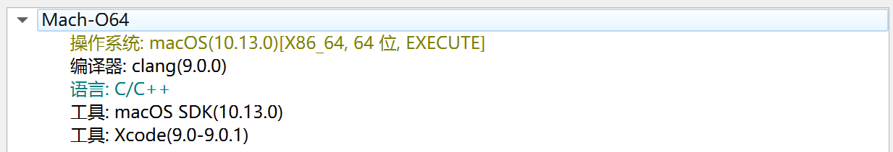
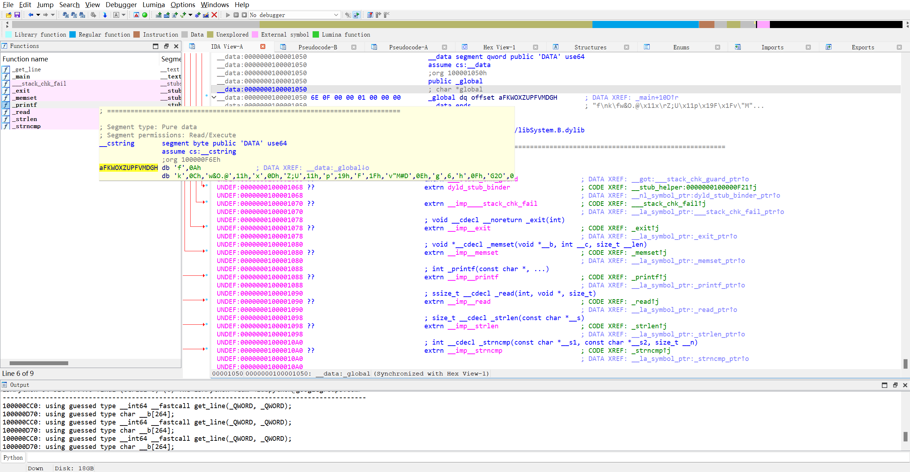

# 逆向做题笔记

## 练习记录

### [Reverse-easyre](https://buuoj.cn/challenges#easyre)

先用DIE查壳，发现是个无壳的64位程序

使用IDA64打开`easyre.exe`文件，找到程序的入口`main`:

```c
int __cdecl main(int argc, const char **argv, const char **envp)
{
  int b; // [rsp+28h] [rbp-8h] BYREF
  int a; // [rsp+2Ch] [rbp-4h] BYREF

  _main();
  scanf("%d%d", &a, &b);
  if ( a == b )
    printf("flag{this_Is_a_EaSyRe}");
  else
    printf("sorry,you can't get flag");
  return 0;
}
```

上面这段程序的逻辑是读入两个 `int` 类型数字 `a` 和 `b` ，如果两个数字相等则输出flag，否则输出错误信息，从而获得 `flag` :

```plain
flag{this_Is_a_EaSyRe}
```

### [Reverse-reverse1](https://buuoj.cn/challenges#reverse1)

先用DIE查壳，发现是个无壳的64位程序

使用IDA64打开`reverse_1.exe`文件，找到程序的入口`main_0`:

```c
int __cdecl main_0(int argc, const char **argv, const char **envp)
{
  char *v3; // rdi
  __int64 i; // rcx
  size_t v5; // rax
  char v7; // [rsp+0h] [rbp-20h] BYREF
  int j; // [rsp+24h] [rbp+4h]
  char Str1[224]; // [rsp+48h] [rbp+28h] BYREF
  __int64 v10; // [rsp+128h] [rbp+108h]

  v3 = &v7;
  for ( i = 82i64; i; --i )
  {
    *(_DWORD *)v3 = -858993460;
    v3 += 4;
  }
  for ( j = 0; ; ++j )
  {
    v10 = j;
    if ( j > j_strlen(Str2) )
      break;
    if ( Str2[j] == 111 )
      Str2[j] = 48;
  }
  sub_1400111D1("input the flag:");
  sub_14001128F("%20s", Str1);
  v5 = j_strlen(Str2);
  if ( !strncmp(Str1, Str2, v5) )
    sub_1400111D1("this is the right flag!\n");
  else
    sub_1400111D1("wrong flag\n");
  return 0;
}
```

通过结合运行结果和程序来看，这段程序中的 `sub_1400111D1` 对应的应该是 `printf` 函数， `sub_14001128F` 对应的应该是 `scanf` 函数，可以选中后使用 `右键 >> Rename global item` 进行替换。

接下来我们观察上面这一段 `for` 循环，这段 `for` 循环的逻辑似乎是遍历 `Str2` 的每一位，如果该位的值为 `111` 则将其替换为 `48` 由于 `Str2` 的类型是字符数组，所以 `111` 和 `48` 应该是ASCII码对应的字符 可以选中后 `右键 >> Char` 将其转化为字符，最终我们得到的程序如下:

```c
int __cdecl main_0(int argc, const char **argv, const char **envp)
{
  char *v3; // rdi
  __int64 i; // rcx
  size_t v5; // rax
  char v7; // [rsp+0h] [rbp-20h] BYREF
  int j; // [rsp+24h] [rbp+4h]
  char Str1[224]; // [rsp+48h] [rbp+28h] BYREF
  __int64 v10; // [rsp+128h] [rbp+108h]

  v3 = &v7;
  for ( i = 82i64; i; --i )
  {
    *(_DWORD *)v3 = -858993460;
    v3 += 4;
  }
  for ( j = 0; ; ++j )
  {
    v10 = j;
    if ( j > j_strlen(Str2) )
      break;
    if ( Str2[j] == 'o' )
      Str2[j] = '0';
  }
  printf("input the flag:");
  scanf("%20s", Str1);
  v5 = j_strlen(Str2);
  if ( !strncmp(Str1, Str2, v5) )
    printf("this is the right flag!\n");
  else
    printf("wrong flag\n");
  return 0;
}
```

这样，程序的逻辑就变得非常清晰了：将 `Str2` 中的每个 `o` 替换为 `0` ，读入一个字符串 `Str1` 与其进行比较，如果相同说明校验成果，否则输出错误信息，接下来我们要做的就是找到 `Str2` 以便得知我们需要输入的信息。

双击 `Str2` 跳转到静态数据区，可以观察到这样一段代码

```asm
.data:000000014001C000                               ; char Str2[]
.data:000000014001C000 7B 68 65 6C 6C 6F 5F 77 6F 72+Str2 db '{hello_world}',0               ; DATA XREF: main_0+4B↑o
```

说明 `Str2` 的初始值为 `{hello_world}` 经过 `for` 循环处理后获得 `{hell0_w0rld}` ，由此获得 `flag` .

```plain
flag{hell0_w0rld}
```

### [Reverse-reverse2](https://buuoj.cn/challenges#reverse2)

先用DIE查壳，这次是个ELF64文件

使用IDA64打开`reverse_2`文件，找到程序的入口`main`:

```c
int __cdecl main(int argc, const char **argv, const char **envp)
{
  int stat_loc; // [rsp+4h] [rbp-3Ch] BYREF
  int i; // [rsp+8h] [rbp-38h]
  __pid_t pid; // [rsp+Ch] [rbp-34h]
  char s2[24]; // [rsp+10h] [rbp-30h] BYREF
  unsigned __int64 v8; // [rsp+28h] [rbp-18h]

  v8 = __readfsqword(0x28u);
  pid = fork();
  if ( pid )
  {
    waitpid(pid, &stat_loc, 0);
  }
  else
  {
    for ( i = 0; i <= strlen(&flag); ++i )
    {
      if ( *(&flag + i) == 'i' || *(&flag + i) == 'r' )
        *(&flag + i) = '1';
    }
  }
  printf("input the flag:");
  __isoc99_scanf("%20s", s2);
  if ( !strcmp(&flag, s2) )
    return puts("this is the right flag!");
  else
    return puts("wrong flag!");
}
```

可以发现与上一题大同小异，这段程序的逻辑是将flag中的 `i` 和 `r` 替换为 `1` ，接下来单击 `flag` 查找其具体值

```asm
.data:0000000000601080 7B                            flag db '{'                             ; DATA XREF: main+34↑r
.data:0000000000601080                                                                       ; main+44↑r
.data:0000000000601080                                                                       ; main+54↑w
.data:0000000000601080                                                                       ; main+65↑o
.data:0000000000601080                                                                       ; main+BD↑o
.data:0000000000601081 68 61 63 6B 69 6E 67 5F 66 6F+aHackingForFun db 'hacking_for_fun}',0
```

可以得知 `flag` 的值为 `{hacking_for_fun}` (注意别漏了最开始的 `{` )，依照 `main` 函数的方法对 `flag` 进行处理，得到 `flag` :

```plain
flag{hack1ng_fo1_fun}
```

### [Reverse-reverse3](https://buuoj.cn/challenges#reverse3)

先用DIE查壳，这次是个PE32文件

使用IDA打开`reverse_3.exe`文件，找到程序的入口`main`:

```c
int __cdecl main_0(int argc, const char **argv, const char **envp)
{
  int v3; // eax
  const char *v4; // eax
  size_t v5; // eax
  char v7; // [esp+0h] [ebp-188h]
  char v8; // [esp+0h] [ebp-188h]
  signed int j; // [esp+DCh] [ebp-ACh]
  int i; // [esp+E8h] [ebp-A0h]
  signed int v11; // [esp+E8h] [ebp-A0h]
  char Destination[108]; // [esp+F4h] [ebp-94h] BYREF
  char Str[28]; // [esp+160h] [ebp-28h] BYREF
  char v14[8]; // [esp+17Ch] [ebp-Ch] BYREF

  for ( i = 0; i < 100; ++i )
  {
    if ( (unsigned int)i >= 0x64 )
      j____report_rangecheckfailure();
    Destination[i] = 0;
  }
  printf("please enter the flag:", v7);
  scanf("%20s", (char)Str);
  v3 = j_strlen(Str);
  v4 = (const char *)sub_4110BE((int)Str, v3, (int)v14);
  strncpy(Destination, v4, 0x28u);
  v11 = j_strlen(Destination);
  for ( j = 0; j < v11; ++j )
    Destination[j] += j;
  v5 = j_strlen(Destination);
  if ( !strncmp(Destination, Str2, v5) )
    printf("rigth flag!\n", v8);
  else
    printf("wrong flag!\n", v8);
  return 0;
}
```

程序的大体逻辑如下:

1. 提示用户输入一个 `Str` 字符串。

2. 调用 `sub_4110BE` 函数，处理 `Str` 数组并赋值给 `v4`。

3. 将 `v4` 数组的内容复制到 `Destination` 数组中。

4. 遍历 `Destination` 中的每个字符，将其值加上其索引值 `j`。

5. 比较处理后的 `Destination` 字符串和 `Str2` 字符串，如果 `Destination` 与 `Str2` 相同，则打印 `right flag!`, 如果不同，则打印 `wrong flag!` 。

接下来的问题就是 `sub_4110BE` 函数到底是干什么的，双击进入该函数，可以发现如下代码:

```c
void *__cdecl sub_411AB0(char *a1, unsigned int a2, int *a3)
{
  int v4; // [esp+D4h] [ebp-38h]
  int v5; // [esp+D4h] [ebp-38h]
  int v6; // [esp+D4h] [ebp-38h]
  int v7; // [esp+D4h] [ebp-38h]
  int i; // [esp+E0h] [ebp-2Ch]
  unsigned int v9; // [esp+ECh] [ebp-20h]
  int v10; // [esp+ECh] [ebp-20h]
  int v11; // [esp+ECh] [ebp-20h]
  void *v12; // [esp+F8h] [ebp-14h]
  char *v13; // [esp+104h] [ebp-8h]

  if ( !a1 || !a2 )
    return 0;
  v9 = a2 / 3;
  if ( (int)(a2 / 3) % 3 )
    ++v9;
  v10 = 4 * v9;
  *a3 = v10;
  v12 = malloc(v10 + 1);
  if ( !v12 )
    return 0;
  j_memset(v12, 0, v10 + 1);
  v13 = a1;
  v11 = a2;
  v4 = 0;
  while ( v11 > 0 )
  {
    byte_41A144[2] = 0;
    byte_41A144[1] = 0;
    byte_41A144[0] = 0;
    for ( i = 0; i < 3 && v11 >= 1; ++i )
    {
      byte_41A144[i] = *v13;
      --v11;
      ++v13;
    }
    if ( !i )
      break;
    switch ( i )
    {
      case 1:
        *((_BYTE *)v12 + v4) = aAbcdefghijklmn[(int)(unsigned __int8)byte_41A144[0] >> 2];
        v5 = v4 + 1;
        *((_BYTE *)v12 + v5) = aAbcdefghijklmn[((byte_41A144[1] & 0xF0) >> 4) | (16 * (byte_41A144[0] & 3))];
        *((_BYTE *)v12 + ++v5) = aAbcdefghijklmn[64];
        *((_BYTE *)v12 + ++v5) = aAbcdefghijklmn[64];
        v4 = v5 + 1;
        break;
      case 2:
        *((_BYTE *)v12 + v4) = aAbcdefghijklmn[(int)(unsigned __int8)byte_41A144[0] >> 2];
        v6 = v4 + 1;
        *((_BYTE *)v12 + v6) = aAbcdefghijklmn[((byte_41A144[1] & 0xF0) >> 4) | (16 * (byte_41A144[0] & 3))];
        *((_BYTE *)v12 + ++v6) = aAbcdefghijklmn[((byte_41A144[2] & 0xC0) >> 6) | (4 * (byte_41A144[1] & 0xF))];
        *((_BYTE *)v12 + ++v6) = aAbcdefghijklmn[64];
        v4 = v6 + 1;
        break;
      case 3:
        *((_BYTE *)v12 + v4) = aAbcdefghijklmn[(int)(unsigned __int8)byte_41A144[0] >> 2];
        v7 = v4 + 1;
        *((_BYTE *)v12 + v7) = aAbcdefghijklmn[((byte_41A144[1] & 0xF0) >> 4) | (16 * (byte_41A144[0] & 3))];
        *((_BYTE *)v12 + ++v7) = aAbcdefghijklmn[((byte_41A144[2] & 0xC0) >> 6) | (4 * (byte_41A144[1] & 0xF))];
        *((_BYTE *)v12 + ++v7) = aAbcdefghijklmn[byte_41A144[2] & 0x3F];
        v4 = v7 + 1;
        break;
    }
  }
  *((_BYTE *)v12 + v4) = 0;
  return v12;
}
```

通过分析 ~~(询问AI)~~ 可知这是一段 `base64` 加密程序，其中 `aAbcdefghijklmn` 数组的值为 `ABCDEFGHIJKLMNOPQRSTUVWXYZabcdefghijklmnopqrstuvwxyz0123456789+/=` 与标准的 `base64` 编码表一致。

至此，我们可以得知这段程序的逻辑是对输入的字符串先进行base64加密，接着对每位进行移位操作，与Str2字符串进行比对校验。

进入静态数据区我们可以获得字符串 `Str2` 的值为 `e3nifIH9b_C@n@dH`

```asm
.data:0041A034                               ; char Str2[]
.data:0041A034 65 33 6E 69 66 49 48 39 62 5F+Str2 db 'e3nifIH9b_C@n@dH',0            ; DATA XREF: _main_0+142↑o
```

对main函数流程逆向获得解密程序

```python
import base64

Str2 = "e3nifIH9b_C@n@dH"
temp = ""

# 逆向索引偏移操作
for i in range(len(Str2)):
    # 将每个字符的ASCII值减去其索引值
    temp += chr(ord(Str2[i]) - i)

# 对结果进行Base64解码
flag = base64.b64decode(temp).decode('utf-8')

print(f"The flag is: flag{flag}")
```

从而获得 `flag`:

```plain
flag{i_l0ve_you}
```

### [Reverse-内涵的软件](https://buuoj.cn/challenges#内涵的软件)

先用DIE查壳，这次是个PE32文件

先运行一下程序

```bash
hervey@Hervey MINGW64 ~/Desktop
$ ./70125468-0786-4705-bd91-87037f8f3e16.exe
距离出现答案还有5秒，请耐心等待！
距离出现答案还有4秒，请耐心等待！
距离出现答案还有3秒，请耐心等待！
距离出现答案还有2秒，请耐心等待！
距离出现答案还有1秒，请耐心等待！
距离出现答案还有0秒，请耐心等待！


这里本来应该是答案的,但是粗心的程序员忘记把变量写进来了,你要不逆向试试看:(Y/N)
Y
OD吾爱破解或者IDA这些逆向软件都挺好的！
hervey@Hervey MINGW64 ~/Desktop
$ ./70125468-0786-4705-bd91-87037f8f3e16.exe
距离出现答案还有5秒，请耐心等待！
距离出现答案还有4秒，请耐心等待！
距离出现答案还有3秒，请耐心等待！
距离出现答案还有2秒，请耐心等待！
距离出现答案还有1秒，请耐心等待！
距离出现答案还有0秒，请耐心等待！


这里本来应该是答案的,但是粗心的程序员忘记把变量写进来了,你要不逆向试试看:(Y/N)
N
那没办法了，猜是猜不出的．
```

猜测 `flag` 应该要到源程序中找

使用IDA打开`70125468-0786-4705-bd91-87037f8f3e16.exe`文件，找到程序的入口`main`:

```c
int __cdecl main_0(int argc, const char **argv, const char **envp)
{
  char v4[4]; // [esp+4Ch] [ebp-Ch] BYREF
  const char *v5; // [esp+50h] [ebp-8h]
  int v6; // [esp+54h] [ebp-4h]

  v6 = 5;
  v5 = "DBAPP{49d3c93df25caad81232130f3d2ebfad}";
  while ( v6 >= 0 )
  {
    printf(&byte_4250EC, v6);
    sub_40100A();
    --v6;
  }
  printf(asc_425088);
  v4[0] = 1;
  scanf("%c", v4);
  if ( v4[0] == 'Y' )
  {
    printf(aOd);
    return sub_40100A();
  }
  else
  {
    if ( v4[0] == 'N' )
      printf(&byte_425034);
    else
      printf(&byte_42501C);
    return sub_40100A();
  }
}
```

看到有一串字符串 `v5 = "DBAPP{49d3c93df25caad81232130f3d2ebfad}";` 由此获得 `flag`

```plain
flag{49d3c93df25caad81232130f3d2ebfad}
```

### [Reverse-新年快乐](https://buuoj.cn/challenges#新年快乐)

惯例先用 DIE 查壳，可以发现有一层 UPX 壳


使用 [upx 工具](https://upx.github.io/) 进行脱壳

```shell
┌──(hervey㉿Hervey)-[/mnt/c/Users/hervey/Desktop]
└─$ upx -d ./新年快乐.exe
                       Ultimate Packer for eXecutables
                          Copyright (C) 1996 - 2024
UPX 4.2.2       Markus Oberhumer, Laszlo Molnar & John Reiser    Jan 3rd 2024

        File size         Ratio      Format      Name
   --------------------   ------   -----------   -----------
     27807 <-     21151   76.06%    win32/pe     新年快乐.exe

Unpacked 1 file.
```

接下来就可以使用 IDA/Ghidra 等工具进行逆向分析了，这里用 IDA 打开

```c
int __cdecl main(int argc, const char **argv, const char **envp)
{
  char Str2[14]; // [esp+12h] [ebp-3Ah] BYREF
  char Str1[44]; // [esp+20h] [ebp-2Ch] BYREF

  __main();
  strcpy(Str2, "HappyNewYear!");
  memset(Str1, 0, 32);
  printf("please input the true flag:");
  scanf("%s", Str1);
  if ( !strncmp(Str1, Str2, strlen(Str2)) )
    return puts("this is true flag!");
  else
    return puts("wrong!");
}
```

分析这段程序可以知道 Str2 就是 flag ，其值为 `HappyNewYear!`，由此得到 flag

```plain
flag{HappyNewYear!}
```

### [Reverse-xor](https://buuoj.cn/challenges#xor)

先用 DIE 查壳，可以发现是 MacOS x86-64 程序



使用 IDA64 进行静态分析

```c
int __cdecl main(int argc, const char **argv, const char **envp)
{
  int i; // [rsp+2Ch] [rbp-124h]
  char __b[264]; // [rsp+40h] [rbp-110h] BYREF

  memset(__b, 0, 0x100uLL);
  printf("Input your flag:\n");
  get_line(__b, 256LL);
  if ( strlen(__b) != 33 )
    goto LABEL_7;
  for ( i = 1; i < 33; ++i )
    __b[i] ^= __b[i - 1];
  if ( !strncmp(__b, global, 041uLL) )
    printf("Success");
  else
LABEL_7:
    printf("Failed");
  return 0;
}
```

这段程序的逻辑是输入 `flag` ，长度要求 33 位，对该字符串进行前缀异或和的操作后与 `global` 变量进行对比，一致输出 `Success` ，不一致则输出 `Failed` 。

点击 `global` 跳转到静态变量区，可以得到 `global` 变量的值为

```plain
'f',0Ah,'k',0Ch,'w&O.@',11h,'x',0Dh,'Z;U',11h,'p',19h,'F',1Fh,'v"M#D',0Eh,'g',6,'h',0Fh,'G2O',0
```



根据异或运算的性质，我们对前缀异或和的操作进行逆向，即再进行一次邻项差分以解密 flag，使用如下 python 代码实现这一过程。

```python
text = ['f', 0x0A, 'k', 0x0C, 'w', '&', 'O', '.', '@', 0x11, 'x', 0xD, 'Z', ';', 'U', 0x11, 'p', 0x19, 'F', 0x1F, 'v', '"', 'M', '#', 'D', 0x0E, 'g', 6, 'h', 0x0F, 'G', '2', 'O' ]
flag = "f"

for i in range(len(text)):
    if isinstance   (text[i], str):
        text[i] = ord(text[i])

for i in range(len(text) - 1):
    flag = flag + chr((text[i] ^ text[i + 1]))

print(flag)
```

运行以上脚本即可获得 flag

```plain
┌──(hervey㉿Hervey)-[/mnt/c/Users/hervey/Desktop]
└─$ python3 ./xor.py
flag{QianQiuWanDai_YiTongJiangHu}
```

### [Reverse-helloword](https://buuoj.cn/challenges#helloword)

下载下来后发现是个 apk 文件，使用 jadx-gui 工具打开，找到 `com.example.helloworld` 下的 `MainActivity` ，得到逆向后的代码为

```java
package com.example.helloword;

import android.os.Bundle;
import android.support.v7.app.ActionBarActivity;
import android.view.Menu;
import android.view.MenuItem;

/* loaded from: classes.dex */
public class MainActivity extends ActionBarActivity {
    /* JADX INFO: Access modifiers changed from: protected */
    @Override // android.support.v7.app.ActionBarActivity, android.support.v4.app.FragmentActivity, android.app.Activity
    public void onCreate(Bundle savedInstanceState) {
        super.onCreate(savedInstanceState);
        setContentView(R.layout.activity_main);
        "flag{7631a988259a00816deda84afb29430a}".compareTo("xxxxxxxxxxxxxxxxxxxxxxxxxxxxxxxxxxxxx");
    }

    @Override // android.app.Activity
    public boolean onCreateOptionsMenu(Menu menu) {
        getMenuInflater().inflate(R.menu.main, menu);
        return true;
    }

    @Override // android.app.Activity
    public boolean onOptionsItemSelected(MenuItem item) {
        int id = item.getItemId();
        if (id == R.id.action_settings) {
            return true;
        }
        return super.onOptionsItemSelected(item);
    }
}
```

在 `onCreate()` 函数中将 flag 与另一个字符串进行对比，由此我们可以直接获得 flag

```plain
flag{7631a988259a00816deda84afb29430a}
```
